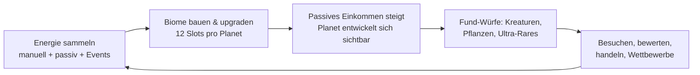

# 🪐 Planet Forge

**Jeder Spieler besitzt einen kleinen schwebenden Planeten – anfangs ein kahler Felsen.**
Durch Spielen sammelst du Energie, baust damit Biome (von der Wiese bis zur Kosmischen Ebene), schaltest Tiere, Pflanzen und Gebäude frei und siehst zu, wie sich deine Welt sichtbar weiterentwickelt. Serverweite Live-Events, extrem seltene Funde bis 1:1.000.000, Besuche auf fremden Planeten und ein sicheres Handelssystem machen daraus eine lebendige, soziale Sammelwelt. Monetarisierung ist **ausschließlich kosmetisch** – kein Pay-to-Win.

---

## Das Spiel in 60 Sekunden



- **Energie sammeln:** Manuelles Sammeln bringt 5 Energie (6 s Cooldown), Biome erzeugen passives Einkommen (alle 60 s anteilig gutgeschrieben). Start: 50 Energie.
- **Biome bauen:** 10 Biom-Typen, 12 Slots pro Planet, jedes Biom bis Level 5 ausbaubar.
- **Funde würfeln:** Ein Loot-Roll kostet 25 Energie – von Common bis zum Kosmischen Kern (1:1.000.000).
- **Sozial:** Andere Planeten besuchen, bewerten, handeln, gemeinsam Events erleben.

## Features

### 🌿 Biome & Progression
10 Biome von **Wiese** (25 Energie) bis **Kosmische Ebene** (100.000 Energie), freigeschaltet über Lifetime-Energie. Jedes Biom hat 5 Level (Upgrade-Kosten × 1,75 pro Level) und skaliert sein Energie-Einkommen linear mit dem Level. Details und komplette Zahlentabellen: [Game Design](docs/GAME_DESIGN.md).

### ☄️ Globale Live-Events
Serverweit und für alle gleichzeitig aktiv – der Scheduler prüft jede Minute und startet mit 25 % Chance ein Event (frühestens 15 min nach dem letzten):

| Event | Dauer | Effekt |
| --- | --- | --- |
| Meteoritenschauer | 5 min | Loot-Glück ×3 |
| Goldener Regen | 6 min | Energie ×2 |
| Seltene Kreaturen | 5 min | Loot-Glück ×5 |
| Alien-Invasion | 8 min | Energie ×1,5 **und** Loot-Glück ×1,5 |
| Schwarzes Loch | 10 min | Energie ×3 |

Alle Mechaniken in [Events](docs/EVENTS.md).

### 💎 Ultra-Rares
Drei Funde, die vor jedem normalen Seltenheits-Wurf einzeln gewürfelt werden – sammelbar und handelbar:

| Fund | Chance | Tier |
| --- | --- | --- |
| Leuchtender Kristall | **1 : 10.000** | Legendary |
| Goldener Drache | **1 : 100.000** | Mythic |
| Kosmischer Kern | **1 : 1.000.000** | Cosmic |

Event-Loot-Glück verbessert diese Chancen direkt (Divisor durch den Multiplikator).

### 🤝 Multiplayer
Besuche fremder Planeten mit Bewertungssystem, Clans, die gemeinsam Galaxien bauen, sicheres Handelssystem (max. 4 Items + Energie pro Seite, 3 s Sicherheits-Lock, atomare Ausführung), Wettbewerbe für den schönsten Planeten und PvE-Bosse für Gruppen. Konzept: [Multiplayer](docs/MULTIPLAYER.md).

### 🏆 Rangliste, Tagesbonus & Planeten-Namen
Globale Ranglisten („Meiste Likes" und „Meiste Gesamt-Energie" über alle Server, via OrderedDataStore) plus Live-Werte in der Spielerliste (leaderstats). Täglicher Login-Bonus mit Streak (Tag 1: 50 bis Tag 7+: 600 Energie). Jeder Planet trägt ein Namensschild – den Namen vergibst du selbst (automatisch gefiltert).

### 💰 Monetarisierung: nur Kosmetik
Planeten-Skins, Auren, Wettereffekte, Haustiere und später ein Battle Pass – **keine** kaufbaren Gameplay-Vorteile. Der Robux-Shop (Gamepässe + Einzelkäufe über die offiziellen Roblox-Kaufdialoge) ist bereits implementiert; im Creator Dashboard angelegte Produkt-IDs werden in `MonetizationConfig.luau` eingetragen. Richtlinien und Compliance: [Monetarisierung](docs/MONETARISIERUNG.md).

## Dokumentation

| Dokument | Inhalt |
| --- | --- |
| [docs/ANLEITUNG.md](docs/ANLEITUNG.md) | **Schritt-für-Schritt aufs echte Roblox** – extra einfach erklärt, ohne Vorwissen. |
| [docs/GAME_DESIGN.md](docs/GAME_DESIGN.md) | Kernloop, Biome, Progression und Loot-System mit allen verbindlichen Balancing-Zahlen. |
| [docs/EVENTS.md](docs/EVENTS.md) | Die fünf globalen Live-Events, Scheduler-Logik und Effekt-Stacking. |
| [docs/MULTIPLAYER.md](docs/MULTIPLAYER.md) | Planetenbesuche, Clans/Galaxien, Handelssystem, Wettbewerbe und PvE-Bosse. |
| [docs/MONETARISIERUNG.md](docs/MONETARISIERUNG.md) | Kosmetik-Katalog, Battle Pass und Roblox-Compliance – strikt ohne Pay-to-Win. |
| [docs/ARCHITEKTUR.md](docs/ARCHITEKTUR.md) | Technische Architektur, Datenmodell, Remotes und Server-Autorität/Sicherheit. |
| [docs/ROADMAP.md](docs/ROADMAP.md) | Phasenplan von Prototyp (P0) bis Live-Ops. |

## Projektstruktur

```text
src/
├── shared/                          → ReplicatedStorage.Shared
│   ├── Types.luau                   Gemeinsame Luau-Typen (Spielerdaten, Planet, Handel …)
│   ├── Remotes.luau                 Zentrale Definition aller RemoteEvents/-Functions
│   ├── Config/
│   │   ├── GameConfig.luau          Globale Konstanten (12 Slots, Kosten, Cooldowns, Ticks)
│   │   ├── BiomeConfig.luau         Die 10 Biome: Kosten, Freischaltung, Einkommen
│   │   ├── RarityConfig.luau        Seltenheits-Tiers und Gewichte (Common 60 … Legendary 1)
│   │   ├── CollectibleConfig.luau   Sammelobjekte inkl. der drei Ultra-Rares
│   │   ├── EventConfig.luau         Die fünf globalen Events (Dauer, Effekt, Gewicht)
│   │   └── MonetizationConfig.luau  Robux-Shop: Kosmetik-Katalog, Gamepässe, Products
│   └── Util/
│       └── WeightedRandom.luau      Gewichtete Zufallsauswahl für Loot und Events
├── server/                          → ServerScriptService.Server
│   ├── init.server.luau             Server-Bootstrap: startet alle Services
│   └── Services/
│       ├── DataService.luau         Laden/Speichern der Spielerdaten (DataStore)
│       ├── PlanetService.luau       Biome bauen und upgraden (server-autoritativ)
│       ├── EnergyService.luau       Manuelles Sammeln + passives Einkommen
│       ├── LootService.luau         Fund-Würfe inkl. Ultra-Rare-Rolls
│       ├── GlobalEventService.luau  Event-Scheduler und aktive Multiplikatoren
│       ├── VisitService.luau        Besuche und Bewertungen fremder Planeten
│       ├── TradeService.luau        Handel mit Lock-Phase und atomarer Ausführung
│       ├── MonetizationService.luau Robux-Käufe, Kosmetik, Haustiere, Studio-Testmodus
│       ├── LeaderboardService.luau  Globale Ranglisten (OrderedDataStore) + leaderstats
│       ├── DailyRewardService.luau  Täglicher Login-Bonus mit Streak
│       ├── TutorialService.luau     First-Time Experience (validiert Schritte)
│       ├── BiomeVisuals.luau        Prozedurale Biom-Deko (Bau-Hilfe, kein Service)
│       └── SelfCheckService.luau    Selbsttest der Konfiguration bei Serverstart
└── client/                          → StarterPlayer.StarterPlayerScripts.Client
    ├── init.client.luau             Client-Bootstrap: startet alle Controller
    └── Controllers/
        ├── EffectsController.luau   Sounds, fliegende Zahlen, Shake (startet zuerst)
        ├── UIController.luau        HUD, Toasts, Loot-Popup mit Spannungsaufbau
        ├── PlanetBuilderController.luau   Bau-Interface für Biom-Slots
        ├── EventNotifierController.luau   Banner/Effekte bei globalen Events
        ├── ShopController.luau      Robux-Shop mit Tabs und "Meine Kosmetik"
        ├── LeaderboardController.luau     Ranglisten-Panel (🏆)
        ├── PlanetNameController.luau      Planet benennen (✏️)
        └── TutorialController.luau  Geführte erste Schritte mit Highlights
```

Dazu kommt `tests/` – ein Testlauf, der die echten Shared-Module in einer Luau-VM ausführt und Logik/Balancing prüft ([Anleitung](tests/README.md)); im Spiel prüft der `SelfCheckService` dieselben Invarianten bei jedem Serverstart.

Das Mapping ins Roblox-DataModel definiert [`default.project.json`](default.project.json) (Rojo): `shared` wird auf Server **und** Client repliziert, `server` läuft ausschließlich serverseitig, `client` startet pro Spieler. Alle Balancing-Werte liegen in `src/shared/Config/` – Code liest sie nur, statt Zahlen zu duplizieren.

## Loslegen (einfachster Weg) 🚀

**Ohne Werkzeuge:** [`PlanetForge.rbxlx`](PlanetForge.rbxlx) herunterladen und doppelklicken – Roblox Studio öffnet das fertige Spiel. Danach der [Schritt-für-Schritt-Anleitung](docs/ANLEITUNG.md) folgen (Play drücken, veröffentlichen, Speichern aktivieren, öffentlich machen). Die Datei wird aus `src/` generiert (`node tools/build-rbxlx.mjs`) – Quelle der Wahrheit bleibt `src/`.

## Loslegen (Entwicklung mit Rojo)

Voraussetzungen: Roblox Studio und [Rokit](https://github.com/rojo-rbx/rokit) (Toolchain-Manager).

1. **Rokit installieren** (einmalig):
   ```bash
   # Windows (PowerShell) / macOS / Linux – siehe Rokit-README für den jeweiligen Installer
   curl -fsSL https://raw.githubusercontent.com/rojo-rbx/rokit/main/scripts/install.sh | bash
   ```
2. **Toolchain installieren** – lädt Rojo 7.4.4 gemäß [`rokit.toml`](rokit.toml):
   ```bash
   rokit install
   ```
3. **Rojo-Server starten** (im Repo-Wurzelverzeichnis):
   ```bash
   rojo serve
   ```
4. **Roblox Studio verbinden:** [Rojo-Plugin](https://rojo.space/docs/v7/getting-started/installation/) in Studio installieren, ein leeres Baseplate öffnen, im Rojo-Plugin auf **Connect** klicken. Der `src/`-Baum wird live synchronisiert.
5. **Play drücken** – der Server-Bootstrap startet alle Services, der Client verbindet sich über die Remotes.

> **Hinweis zu DataStores:** Spielstände werden nur in einem **veröffentlichten** Erlebnis gespeichert, bei dem unter *Game Settings → Security* der **Studio-API-Zugriff** ("Enable Studio Access to API Services") aktiviert ist. In einem unveröffentlichten Baseplate läuft das Spiel trotzdem – Fortschritt geht dann beim Verlassen verloren.

## Status

**Prototyp-Phase P0** (siehe [Roadmap](docs/ROADMAP.md)): Dieses Repository ist ein **spielbares Code-Skelett plus vollständiges Designkonzept** – kein fertiges Spiel.

**Funktioniert bereits:**
- Energie-Loop: manuelles Sammeln (5 Energie / 6 s), passives Einkommen, Persistenz per DataStore
- Biome bauen und upgraden mit allen Canon-Kosten und Freischaltungen (12 Slots, 10 Biome, Level 1–5)
- Loot-Rolls für 25 Energie inkl. der drei Ultra-Rare-Würfe (1:10.000 / 1:100.000 / 1:1.000.000)
- Globaler Event-Scheduler mit den fünf Events und wirksamen Energie-/Loot-Multiplikatoren
- Besuche und Handel innerhalb eines Servers (4 Items + Energie, 3-s-Lock, atomare Ausführung)
- Robux-Kosmetik-Shop: Gamepässe und Einzelkäufe, sichtbare Skins/Auren/Wetter auf dem Planeten, Haustier-Begleiter (Produkt-IDs müssen im Creator Dashboard angelegt und in `MonetizationConfig.luau` eingetragen werden)
- Globale Ranglisten (Likes und Gesamt-Energie) mit Panel im Spiel, leaderstats in der Spielerliste
- Täglicher Login-Bonus mit Streak und eigene Planeten-Namen (serverseitig gefiltert)
- Geführtes Tutorial (4 Schritte mit Highlights, nur beim ersten Mal) und Einsteiger-Hinweise
- Game Feel: Sounds, fliegende Energie-Zahlen, Loot-Spannungsaufbau mit Screen-Shake, prozedurale Biom-Deko pro Level, Weltraum-Himmel, Haustier-Modelle mit Schwebe-Animation
- Studio-Testmodus im Shop (Käufe ohne echte IDs testbar – nur in Studio wirksam)
- Automatisierte Tests: `tests/` (Luau-VM) und `SelfCheckService` (bei jedem Serverstart)

**Fehlt noch (bewusst nicht in P0):**
- Minispiele und Kämpfe als aktive Energie-Quellen
- Clans/Galaxien und Cross-Server-Besuche
- PvE-Bosse, Wettbewerbe und Bewertungs-Leaderboards
- Battle Pass, rotierender Shop und jegliche 3D-Assets/Polish

Feedback und Beiträge sind willkommen – Startpunkt ist das [Game Design](docs/GAME_DESIGN.md), technisch die [Architektur](docs/ARCHITEKTUR.md).
