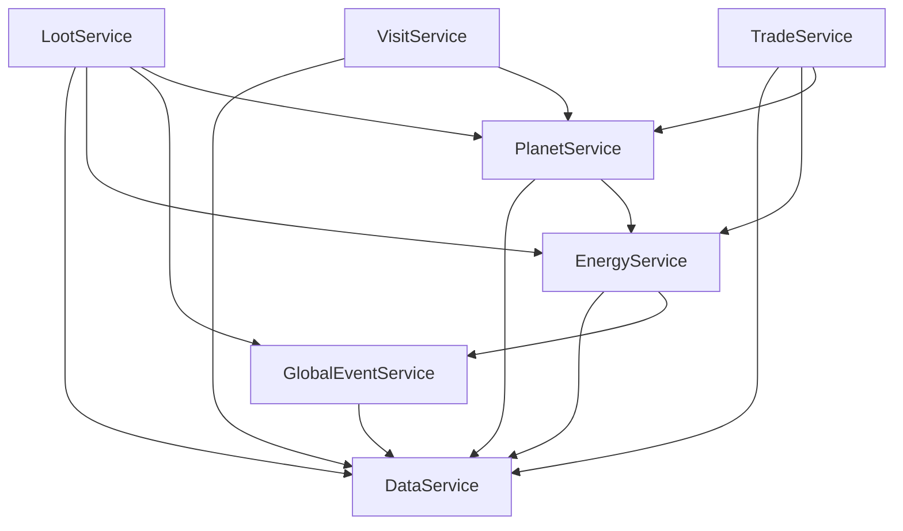

# Technische Architektur

Dieses Dokument beschreibt die technische Architektur von **Planet Forge**: Projektaufbau, Laufzeitstruktur, Datenmodell, Netzwerkprotokoll, Persistenz und Sicherheitskonzept. Spielinhaltliche Entscheidungen stehen in [Game Design](GAME_DESIGN.md), [Events](EVENTS.md), [Multiplayer](MULTIPLAYER.md) und [Monetarisierung](MONETARISIERUNG.md); der Umsetzungsplan in der [Roadmap](ROADMAP.md).

## 1. Überblick

### 1.1 Toolchain und Workflow

- **Rojo 7.4.4** (via `rokit.toml`) synchronisiert das Dateisystem in die Roblox-Instanzhierarchie. Entwickelt wird ausschließlich im Repository, nie direkt in Studio-Instanzen.
- **Strict Luau**: `.luaurc` setzt `languageMode: strict`; jede Datei beginnt mit `--!strict`. Typen aus `src/shared/Types.luau` sind der gemeinsame Vertrag zwischen Server und Client.
- Lokaler Ablauf: `rokit install` → `rojo serve` → Rojo-Plugin in Studio verbinden → Play-Solo-Test.

### 1.2 Mapping Dateisystem → Roblox

Definiert in `default.project.json`:

| Repository-Pfad | Roblox-Instanzpfad | Läuft auf |
|---|---|---|
| `src/shared/` | `ReplicatedStorage.Shared` | Server + Client |
| `src/shared/Config/` | `ReplicatedStorage.Shared.Config` | Server + Client |
| `src/shared/Util/` | `ReplicatedStorage.Shared.Util` | Server + Client |
| `src/server/init.server.luau` | `ServerScriptService.Server` (Script) | Server |
| `src/server/Services/` | `ServerScriptService.Server.Services` | Server |
| `src/client/init.client.luau` | `StarterPlayer.StarterPlayerScripts.Client` (LocalScript) | Client |
| `src/client/Controllers/` | `StarterPlayerScripts.Client.Controllers` | Client |
| — (zur Laufzeit erzeugt) | `ReplicatedStorage.PlanetForgeRemotes` | Server erstellt, Client konsumiert |

Zusätzlich setzt das Projektfile `Workspace.FilteringEnabled = true` und `Lighting.Technology = "Future"`.

### 1.3 Startreihenfolge

**Server** (`src/server/init.server.luau`): zuerst `Remotes.init()` (erzeugt alle RemoteEvents/RemoteFunctions unter `ReplicatedStorage.PlanetForgeRemotes`), danach die Services sequenziell in fester Reihenfolge. Jeder Service exportiert `init()`, das schnell zurückkehrt; langlaufende Schleifen (Autosave, passives Einkommen, Event-Scheduler) starten intern per `task.spawn`.

| # | Service | Warum an dieser Position |
|---|---|---|
| 1 | `DataService` | Daten zuerst: Profile müssen laden, bevor irgendein System Spielerzustand liest oder schreibt. |
| 2 | `PlanetService` | Baut die physischen Plots/Slots, auf die alle Gameplay-Systeme verweisen. |
| 3 | `EnergyService` | Währungslogik; braucht Profile (1) und wird von allem Nachfolgenden benutzt. |
| 4 | `LootService` | Braucht Energie (Wurfkosten) und Planetenkontext. |
| 5 | `GlobalEventService` | Multiplikatoren für Energie und Loot; Scheduler darf erst laufen, wenn die Empfänger stehen. |
| 6 | `VisitService` | Reine Aufsatz-Funktionalität über PlanetService. |
| 7 | `TradeService` | Höchste Schicht: braucht Energie, Items und stabile Profile. |

Querverweise zwischen Services werden zur Aufrufzeit per `require` aufgelöst, nicht im `init()` — dadurch ist die Reihenfolge nur für den *Datenfluss* kritisch (Profile zuerst), nicht für die Modulauflösung. Jeder Service-Start ist in `pcall` gekapselt: Ein fehlschlagender Service blockiert den Serverstart nicht, sondern loggt eine Warnung.

**Client** (`src/client/init.client.luau`): startet `UIController` → `PlanetBuilderController` → `EventNotifierController`, jeweils entkoppelt per `task.spawn`, weil Controller in `init()` auf Remotes warten dürfen (`WaitForChild` auf `PlanetForgeRemotes`). So blockiert ein wartender Controller nie die anderen.

## 2. Architekturprinzipien

1. **Server-autoritativ.** Der Client rendert und *wünscht*; der Server entscheidet. Jede Zustandsänderung (Energie, Biome, Loot, Handel, Likes) passiert ausschließlich serverseitig nach Validierung. Der Client hält nur eine Anzeigekopie, die über RemoteEvents aktualisiert wird.
2. **Konfiguration als Daten.** Sämtliche Balancing-Werte liegen in `src/shared/Config/` (`GameConfig`, `BiomeConfig`, `RarityConfig`, `CollectibleConfig`, `EventConfig`). Services enthalten keine Zahlenliterale fürs Balancing — Rebalancing ist ein Config-Diff, kein Code-Review der Logik.
3. **Dünne Remotes, `(ok, payload)`-Konvention.** Jede RemoteFunction gibt `(ok: boolean, payload: any?)` zurück: bei Erfolg `ok = true` plus Ergebnisdaten, bei Ablehnung `ok = false` plus Fehlermeldung für die UI. Kein Remote transportiert Geschäftslogik; Remotes sind reine Absichtserklärungen des Clients.
4. **Gerichtete Abhängigkeiten.** Services bilden einen azyklischen Graphen; `DataService` ist die gemeinsame Wurzel:

Lesart: `EnergyService` fragt beim Gutschreiben den aktuellen Energie-Multiplikator beim `GlobalEventService` ab; `LootService` zieht Wurfkosten über `EnergyService` ein, holt den Loot-Glücks-Multiplikator vom `GlobalEventService` und stößt Planeten-Snapshots über `PlanetService` an; `TradeService` bewegt Energie über `EnergyService.addRaw` (bewusst ohne Event-Multiplikator) und Items über die Profil-/Snapshot-Pfade.

## 3. Service-Verantwortlichkeiten

| Service | Kern-API | Verantwortung |
|---|---|---|
| `DataService` | `getProfile(player)`, `waitForProfile(player)`, `markDirty(player)` | Laden/Speichern von `PlayerProfile` im DataStore `PlanetForge_v1`. Autosave alle 120 s (nur „dirty" Profile), Speichern bei `PlayerRemoving`, `BindToClose` wartet auf alle offenen Saves. Schreiben ausschließlich per `UpdateAsync`. Schema-Version 1 mit Migrationskette (siehe 4.2). |
| `EnergyService` | `grantEnergy(player, amount)`, `addRaw(player, amount)`, `trySpend(player, cost)` | Einzige Schreibstelle für Energie. `grantEnergy` wendet den Event-Multiplikator an und erhöht `energy` **und** `lifetimeEnergy`; `addRaw` (Handel) verändert nur `energy`, ohne Multiplikator und ohne `lifetimeEnergy` — sonst würden Handelsempfänge Freischaltungen kaufen. `trySpend` prüft Deckung atomar. Bedient `CollectEnergy` (5 Energie, 6 s Cooldown pro Spieler, serverseitig gemessen) und die passive Einkommensschleife: alle 60 s Summe aus `baseEnergyPerMinute * level` aller platzierten Biome. |
| `PlanetService` | `sendSnapshot(player)`, Handler für `PlaceBiome`/`UpgradeBiome` | Legt Spieler-Plots im Kreis an (`PLOT_SPACING_STUDS = 512`, Höhe 120) mit je 12 Slot-Plattformen. Validiert Platzierungen (Slot 1–12, Slot frei, Biom existiert, `lifetimeEnergy` ≥ Freischaltschwelle, Kosten gedeckt) und Upgrades (Slot belegt, `level < maxLevel = 5`, Kosten `floor(baseCost * 1.75^level)` gedeckt). Nach jeder Änderung: `PlanetUpdated`-Snapshot an den Besitzer und aktuelle Besucher. |
| `LootService` | Handler für `RollLoot` | Würfelt Funde ausschließlich serverseitig. Ablauf: 25 Energie via `trySpend` abziehen → Ultra-Rares einzeln prüfen, seltenste zuerst (Kosmischer Kern 1:1.000.000, Goldener Drache 1:100.000, Leuchtender Kristall 1:10.000), jeweils `oneIn(max(1, math.floor(n / lootLuckMultiplier)))` → sonst Tier-Wurf über `WeightedRandom` (Common 60, Uncommon 25, Rare 10, Epic 4, Legendary 1; Mythic/Cosmic Gewicht 0). `uid` per `HttpService:GenerateGUID(false)`, Ergebnis in `profile.collectibles`, `markDirty`, `LootObtained` an den Client. |
| `GlobalEventService` | `getEnergyMultiplier()`, `getLootLuckMultiplier()` | Scheduler-Schleife alle 60 s: startet mit 25 % Chance ein gewichtetes Event, wenn keines läuft und das letzte ≥ 15 min her ist. Publiziert Start/Ende über MessagingService-Topic `PF_GLOBAL_EVENT`, damit alle Server dasselbe Event zeigen; broadcastet `GlobalEventStarted`/`GlobalEventEnded` an Clients. Andere Services *ziehen* die Multiplikatoren zum Zeitpunkt der Gutschrift/des Wurfs. |
| `VisitService` | Handler für `RequestVisit`, `GoHome`, `LikePlanet` | Teleport des Charakters zum Ziel-Plot **im selben Server**. Zählt `visits` einmal pro (Besucher, Ziel, Session); `LikePlanet` maximal einmal pro Session und nie für den eigenen Planeten. |
| `TradeService` | Handler für `TradeAction` | Zustandsmaschine pro Sitzung: `negotiating → locked → completed` (bzw. `cancelled`). Max. 4 Item-`uid`s plus Energie pro Seite. Jede Angebotsänderung setzt beide `accepted`-Flags zurück. Nach beidseitigem Akzeptieren 3 s Lock (keine Änderungen möglich), dann **Revalidierung** (beide online, uids noch im Besitz, Energie noch gedeckt) und atomarer Transfer ohne Yields; danach `markDirty` für beide Profile. |

## 4. Datenmodell

### 4.1 `PlayerProfile` (aus `Types.luau`)

| Feld | Typ | Zweck |
|---|---|---|
| `version` | `number` | Schema-Version des gespeicherten Blobs, aktuell `1` (`GameConfig.PROFILE_SCHEMA_VERSION`). |
| `energy` | `number` | Ausgebbares Guthaben. Sinkt durch Käufe, Loot-Würfe, Handel. |
| `lifetimeEnergy` | `number` | Monoton wachsend: jede *verdiente* Energie zählt hier hinein, Ausgaben nie. Steuert Biom-Freischaltungen — dadurch schaltet Ausgeben nichts zurück, und Fortschritt ist nicht durch Handel kaufbar (`addRaw` erhöht `lifetimeEnergy` bewusst nicht). |
| `biomes` | `{ PlacedBiome }` | Belegte Slots: `biomeId`, `slot` (1–12), `level` (1–5), `placedAt`. Maximal 12 Einträge. |
| `collectibles` | `{ OwnedCollectible }` | Inventar: `uid`, `collectibleId`, `obtainedAt`, `source` (`loot`/`event`/`trade`). Die `uid` (GUID) identifiziert die konkrete Instanz — nur so kann der Handel exakt „dieses eine Item" übertragen und Duplikate erkennen, statt nur Stückzahlen zu verschieben. |
| `visits` / `likes` | `number` | Sozialzähler, geschrieben nur vom `VisitService`. |
| `createdAt` | `number` | Unix-Zeitstempel der Profilerstellung. |

### 4.2 Schema-Versionierung und Migration

Beim Laden vergleicht `DataService` `profile.version` mit `PROFILE_SCHEMA_VERSION`. Migration läuft als Kette reiner Funktionen `migrate[v] : ProfileV → ProfileV+1`, die nacheinander angewendet werden, bis die Zielversion erreicht ist. Regeln:

- Neue Felder erhalten Defaults in der Migrationsfunktion, nie verstreut im Code.
- Migrationsfunktionen werden nie gelöscht oder verändert — alte Blobs müssen für immer ladbar bleiben.
- Ein Blob mit *höherer* Version als der Server (Rollback-Szenario) wird nicht angerührt: Kick mit Fehlermeldung statt Datenverlust.

### 4.3 Größenabschätzung

DataStore-Limit: ~4 MB pro Key. Als JSON grob: Grundgerüst < 200 B, `biomes` maximal 12 × ~70 B ≈ 0,9 KB, `collectibles` ~110 B pro Eintrag (GUID dominiert). Ein Profil mit 5.000 Sammelobjekten liegt bei ~550 KB — weit im Limit, aber Serialisierungszeit und Snapshot-Replikation wachsen mit. Konsequenz: Ab einigen tausend Items sollten stapelbare Commons zu `{collectibleId, count}` verdichtet werden; nur Epic+ behält individuelle `uid`s. Für das Skelett ist das noch nicht umgesetzt.

## 5. Remote-Protokoll

Alle Remotes werden von `Remotes.init()` serverseitig unter `ReplicatedStorage.PlanetForgeRemotes` erzeugt; Zugriff über `Remotes.getEvent(name)` / `Remotes.getFunction(name)`.

### 5.1 RemoteEvents (Server → Client)

| Event | Signatur | Zweck |
|---|---|---|
| `EnergyChanged` | `(newEnergy: number, lifetimeEnergy: number)` | UI-Aktualisierung nach jeder Energieänderung. |
| `PlanetUpdated` | `(snapshot: { biomes, collectibles, visits, likes })` | Vollständiger Anzeige-Snapshot des Planeten nach Bau/Upgrade/Loot/Handel. |
| `LootObtained` | `(collectibleId: string, rarity: string, uid: string)` | Fund-Präsentation (Popup, Effekte) nach `RollLoot`. |
| `GlobalEventStarted` | `(eventId: string, endsAt: number)` | Event-Banner und Countdown starten. |
| `GlobalEventEnded` | `(eventId: string)` | Event-UI beenden. |
| `TradeUpdated` | `(tradeSnapshot: any?)` | Aktueller Sitzungszustand; `nil` = keine aktive Handelssitzung. |
| `Notification` | `(message: string, kind: "info" \| "success" \| "error")` | Generische Toast-Meldungen (u. a. Ablehnungsgründe). |

### 5.2 RemoteFunctions (Client → Server), Rückgabe immer `(ok: boolean, payload: any?)`

| Function | Signatur | Zweck |
|---|---|---|
| `PlaceBiome` | `(biomeId: string, slot: number)` | Biom auf freiem Slot platzieren. |
| `UpgradeBiome` | `(slot: number)` | Biom-Level +1 (bis maxLevel 5). |
| `CollectEnergy` | `()` | Manuelles Sammeln: +5 Energie, 6 s Cooldown. |
| `RollLoot` | `()` | Fund-Wurf für 25 Energie. |
| `RequestVisit` | `(targetUserId: number)` | Zum Planeten eines Mitspielers teleportieren. |
| `GoHome` | `()` | Zurück zum eigenen Plot. |
| `LikePlanet` | `(targetUserId: number)` | Like vergeben (einmal pro Session, nicht selbst). |
| `TradeAction` | `(action: "invite" \| "acceptInvite" \| "setOffer" \| "toggleAccept" \| "cancel", payload: any?)` | Sämtliche Handelsschritte über einen einzigen validierten Endpunkt. |

## 6. Persistenz

**Speicherpfade** (`DataService`, DataStore `PlanetForge_v1`):

1. **Autosave**: alle 120 s, nur Profile, die seit dem letzten Save per `markDirty` markiert wurden.
2. **PlayerRemoving**: sofortiger Save beim Verlassen.
3. **BindToClose**: blockiert den Server-Shutdown, bis alle ausstehenden Saves abgeschlossen sind (Budget ~30 s).

Alle Schreibzugriffe laufen über `UpdateAsync`, nie `SetAsync` — so wird nie blind ein möglicherweise neuerer Stand überschrieben. In Studio ohne API-Zugriff degradiert der `DataService` kontrolliert: frisches Default-Profil im Speicher, Saves werden übersprungen und geloggt statt zu werfen.

### Bekannte Grenzen des Skeletts

Ehrliche Liste dessen, was das aktuelle Skelett **nicht** löst — vor einem Launch zu schließen:

| Lücke | Risiko | Empfehlung |
|---|---|---|
| Kein Session-Locking | Zwei Server halten dasselbe Profil (schneller Rejoin, Teleport): letzter Save gewinnt, Fortschritt/Items gehen verloren oder duplizieren. | ProfileStore (oder eigenes Lock über `UpdateAsync`-Metadaten) einführen, bevor Handel live geht. |
| Trade vor Save nicht crashfest | Server-Crash zwischen atomarem Transfer und nächstem Save: eine Seite gespeichert, die andere nicht → Item-Dupe oder -Verlust. | Sofort-Save beider Profile direkt nach `completed`; langfristig Transaktionslog mit Idempotenz-Key. |
| MessagingService ohne Leader-Wahl | Jeder Server würfelt selbst (60 s / 25 % / 15 min); mehrere Server können konkurrierende Events publizieren. | Leader über MemoryStore bestimmen (siehe Abschnitt 8); bis dahin: frühester `startedAt` gewinnt deterministisch. |
| Keine Rate-Limits pro Remote | Exploiter feuern `RollLoot`/`TradeAction` im Takt der Netzwerkschicht; Server-CPU und DataStore-Budget leiden. | Zentraler Rate-Limiter (Token-Bucket pro Spieler und Remote) als Middleware vor allen Handlern. |
| Likes/Visits ohne Verweildauer | „Einmal pro Session" reicht nicht: Rejoin-Schleifen oder Bot-Konten pumpen Zähler für Wettbewerbe auf. | Mindest-Verweildauer vor Like-Freigabe, persistente Like-Historie pro (Liker, Ziel), Account-Alter prüfen. |

## 7. Sicherheit und Anti-Exploit

**Grundsatz:** Jede Remote-Eingabe ist feindlich, bis das Gegenteil validiert ist. Checkliste, die jeder Handler vollständig durchläuft:

1. **Typ/Form**: Argumenttypen exakt prüfen (`typeof`), keine `nil`-Toleranz, Strings gegen Whitelists (Biom-IDs, Trade-Actions) statt Freitext.
2. **Bereich**: `slot` ganzzahlig in 1–12, `targetUserId` positiv, Angebotsgrößen ≤ 4 Items.
3. **Zustand**: Profil geladen? Slot frei/belegt? `lifetimeEnergy` über der Freischaltschwelle? Cooldown abgelaufen (Zeit misst der Server, nie der Client)?
4. **Deckung**: Kosten via `trySpend` in einem Schritt prüfen *und* abbuchen — kein „prüfen, yielden, abbuchen".
5. **Besitz**: Jede gehandelte `uid` muss im Profil des Anbieters existieren (Duplikate in derselben Offerte ablehnen).
6. **Antwort**: Ablehnung immer als `(false, grund)` — nie `error()` in den Client durchreichen.

**Loot serverseitig:** Der Client sendet nur die Absicht `RollLoot()`. Chance-Berechnung, Ultra-Rare-Reihenfolge, Tier-Gewichte und GUID-Erzeugung passieren komplett auf dem Server; der Client erfährt via `LootObtained` nur das Ergebnis. Alles andere wäre bei 1:1.000.000-Items sofort tot-exploited.

**Trade-Dupe-Schutz** (mehrschichtig):

- **Lock-Phase (3 s)**: Nach beidseitigem Akzeptieren sind Angebote eingefroren — verhindert den klassischen Last-Second-Switch.
- **Revalidierung nach dem Lock**: Besitz aller `uid`s und Energiedeckung werden unmittelbar vor dem Transfer erneut geprüft (der Anbieter könnte das Item inzwischen anders verloren haben).
- **Keine Yields im Transfer**: Der eigentliche Tausch (uids umhängen, `addRaw` beidseitig) läuft synchron in einem Frame — kein `wait`, kein DataStore-Aufruf, kein Remote dazwischen, damit kein zweiter Codepfad denselben Zustand sieht.
- **Eine Sitzung pro Spieler**: Wer in einer aktiven Sitzung ist, kann keine zweite eröffnen oder annehmen.

## 8. Skalierung und Ausblick

- **Cross-Server-Besuche**: `RequestVisit` auf fremde Server erweitern via `TeleportService:TeleportToPlaceInstance` plus Übergabe eines kompakten Planeten-Snapshots (TeleportData bzw. MemoryStore-Cache), damit der Zielserver den Planeten ohne DataStore-Read des Fremdprofils rendern kann. Alternativ: reine „Schaufenster"-Server, die Snapshots read-only laden.
- **Event-Leader über MemoryStore**: Ein Server erwirbt per `MemoryStoreService` (Key mit TTL) die Scheduler-Rolle; nur der Leader würfelt und publiziert auf `PF_GLOBAL_EVENT`, alle anderen konsumieren. Löst die Doppel-Event-Lücke aus Abschnitt 6.
- **Ranglisten**: `OrderedDataStore` für „meiste Likes", „höchste lifetimeEnergy" u. ä.; Schreiben beim Save gebündelt, Lesen gecacht (60 s), Anzeige über die Wettbewerbs-UI aus [Multiplayer](MULTIPLAYER.md).
- **Sharding**: Bei sehr großen Inventaren Profil aufteilen — Kernprofil (Energie, Biome) und Inventar-Shards (`PlanetForge_v1_inv_<n>`) getrennt speichern; Trade-Transaktionslog als eigener Store. Erst nötig, wenn die Verdichtung aus 4.3 nicht mehr reicht.
- **Performance**: Part-Budget pro Plot deckeln (Richtwert: ≤ 500 Parts pro Planet, Biome als vorgebaute, geklonte Modelle mit LOD-Varianten). `StreamingEnabled` ist mit 512 Studs Plot-Abstand die natürliche Option, damit Clients nur nahe Planeten laden — erfordert, dass Controller nie synchron auf entfernte Instanzen zugreifen. Snapshots statt Instanz-Replikation für Besucher-Vorschauen halten den Netzwerkverkehr flach.
