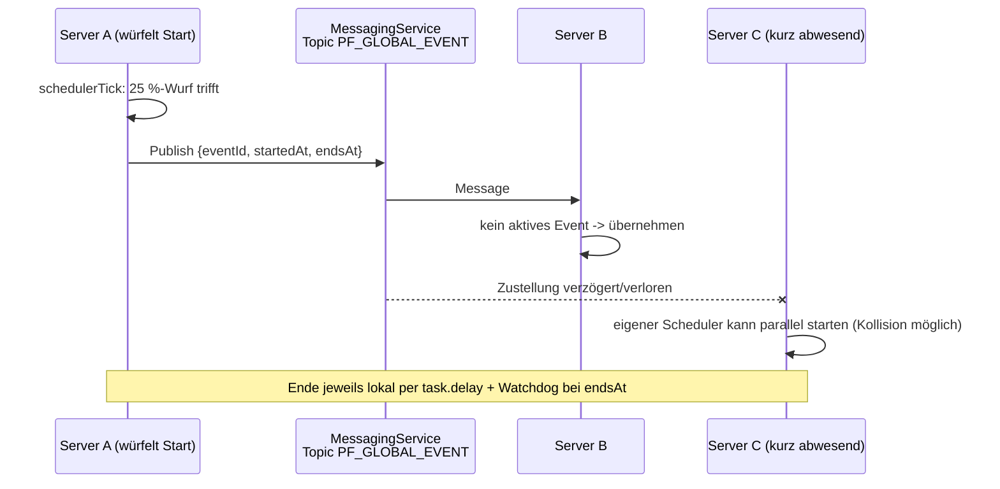

# Planet Forge – Globale Live-Events

Design der serverweiten Live-Events. Verwandte Dokumente: [Spieldesign](GAME_DESIGN.md) · [Multiplayer](MULTIPLAYER.md) · [Monetarisierung](MONETARISIERUNG.md) · [Technische Architektur](ARCHITEKTUR.md) · [Roadmap](ROADMAP.md)

Alle Zahlen sind Canon und identisch mit `src/shared/Config/EventConfig.luau` und `src/shared/Config/GameConfig.luau`. Balancing-Änderungen passieren zuerst in den Config-Dateien und werden hier nachgezogen.

---

## 1. Warum globale Events

Globale Events laufen **serverweit und für alle Spieler gleichzeitig** – nicht pro Spieler, nicht pro Server-Instanz isoliert. Das ist eine bewusste Design-Entscheidung mit drei Zielen:

1. **Gleichzeitige Aktivität.** Wenn der Meteoritenschauer startet, tun in diesem Moment alle Spieler dasselbe: würfeln, sammeln, in den Himmel schauen. Das erzeugt das Gefühl einer lebendigen, geteilten Welt – der Chat explodiert, Freunde pingen sich an, Besucher auf fremden Planeten erleben das Event gemeinsam mit dem Gastgeber. Ein Event, das nur mir passiert, ist ein Buff; ein Event, das allen passiert, ist ein Ereignis.
2. **FOMO in gesunder Dosis.** Events sind kurz (5–10 Minuten), unangekündigt und im Schnitt nur alle ~19 Minuten (Rechnung in Abschnitt 2.2). Wer online ist, wird belohnt; wer nicht online ist, verpasst nichts Exklusives – kein Event-Inhalt ist dauerhaft verloren, es gibt nur temporäre Multiplikatoren. Der Anreiz ist "jetzt einloggen lohnt sich", nicht "wer fehlt, fällt zurück". Das unterscheidet gesunde von toxischer FOMO und ist kompatibel mit der Kein-Pay-to-Win-Linie aus der [Monetarisierung](MONETARISIERUNG.md).
3. **Social-Media-Momente.** Jedes Event ist visuell so inszeniert, dass ein 15-Sekunden-Clip ohne Erklärung funktioniert: brennender Himmel, goldener Regen, ein Schwarzes Loch über dem eigenen Planeten. Kombiniert mit den Ultra-Rare-Chancen (Loot-Glück bis x5) entstehen genau die "ICH HABE DEN DRACHEN GEZOGEN"-Clips, die auf TikTok und YouTube Shorts funktionieren. Jeder Event-Abschnitt unten definiert deshalb explizit seinen Clip-Moment.

Mechanisch wirken Events auf genau zwei Stellschrauben: den **Energie-Multiplikator** (skaliert manuelles Sammeln und passives Einkommen) und den **Loot-Glück-Multiplikator** (verbessert die Ultra-Rare-Chancen der Fund-Würfe, siehe [Spieldesign, Abschnitt 6.4](GAME_DESIGN.md)). Nicht betroffene Multiplikatoren stehen immer auf 1.

---

## 2. Canon: Events und Scheduler

### 2.1 Die fünf Events

| id | Anzeigename | Dauer | Effekt | Gewicht |
|---|---|---:|---|---:|
| `meteoritenschauer` | Meteoritenschauer | 300 s (5 min) | Loot-Glück x3 | 30 |
| `goldener_regen` | Goldener Regen | 360 s (6 min) | Energie x2 | 25 |
| `alien_invasion` | Alien-Invasion | 480 s (8 min) | Energie x1.5 **und** Loot-Glück x1.5 | 20 |
| `kreaturen_spawn` | Seltene Kreaturen | 300 s (5 min) | Loot-Glück x5 | 15 |
| `schwarzes_loch` | Schwarzes Loch | 600 s (10 min) | Energie x3 | 10 |

Die Gewichte summieren sich auf 100, die Auswahl läuft über `WeightedRandom.pick`. Absichtliches Muster: **Je stärker der Effekt, desto seltener das Event.** Meteoritenschauer ist der häufige Brot-und-Butter-Hype, Schwarzes Loch und Seltene Kreaturen sind die raren Höhepunkte.

### 2.2 Scheduler-Regeln und erwartete Frequenz

Der Scheduler in `GlobalEventService` arbeitet mit drei Werten aus `GameConfig`:

| Konstante | Wert | Bedeutung |
|---|---:|---|
| `EVENT_CHECK_INTERVAL_SECONDS` | 60 | Prüfintervall des Schedulers |
| `EVENT_START_CHANCE` | 0.25 | Startchance pro Prüfung, wenn Start erlaubt |
| `EVENT_MIN_GAP_SECONDS` | 900 (15 min) | Mindestabstand seit Ende des letzten Events |

Regel: Alle 60 s prüft der Scheduler. Läuft ein Event, passiert nichts (kein Überlappen, per Konstruktion). Läuft keines **und** das letzte Event endete vor mindestens 15 Minuten, startet mit 25 % Wahrscheinlichkeit ein gewichtet ausgewähltes Event.

**Erwartete Events pro Stunde (Überschlagsrechnung):**

- Wartezeit nach Ablauf des Mindestabstands: geometrisch verteilt mit p = 0.25 pro Minute → im Mittel 1/0.25 = **4 Minuten**.
- Abstand von Event-Ende zu nächstem Event-Start: 15 min Sperre + ~4 min Warten = **~19 min** (deckt sich mit der Angabe im [Spieldesign](GAME_DESIGN.md)).
- Mittlere Event-Dauer (gewichtet): (300·30 + 360·25 + 300·15 + 480·20 + 600·10) / 100 = **381 s ≈ 6,4 min**.
- Voller Zyklus (Start zu Start): ~6,4 + 15 + 4 ≈ **~25 min** → grob **2 bis 2,5 Events pro Stunde**.

Daraus folgt die erwartete Häufigkeit pro Event-Typ (bei ~2,4 Events/h): Meteoritenschauer ~alle 85 min, Goldener Regen ~alle 100 min, Alien-Invasion ~alle 2,1 h, Seltene Kreaturen ~alle 2,8 h, Schwarzes Loch ~alle 4,2 h. Eine typische 30-Minuten-Session erlebt damit im Schnitt ein Event – genug für Hype, wenig genug, dass es besonders bleibt.

---

## 3. Die fünf Events im Detail

Jedes Event folgt derselben Dramaturgie: serverweiter Announce (`announceText` als Notification plus Event-Banner im HUD mit Countdown), sofort sichtbare Welt-Veränderung, Ende mit kurzer Abschieds-Notification. Der `EventNotifierController` auf dem Client besitzt die Inszenierung; der Server kennt nur Zeiten und Multiplikatoren.

### 3.1 Meteoritenschauer (5 min, Loot-Glück x3, Gewicht 30)

- **Fantasie:** Ein Strom glühender Meteoriten zieht über alle Planeten – in den Brocken stecken seltene Materialien. Goldgräberstimmung: kurz, hell, hektisch.
- **Inszenierung:** Himmel färbt sich orange-violett, Leuchtspuren ziehen im Sekundentakt über das Skybox-Panorama, vereinzelte (rein kosmetische) Einschlag-Partikel mit Funken und Rauch auf unbebauten Slots, tiefes Grollen und Zischen als Sound-Layer.
- **Gewünschtes Spielerverhalten:** Gesparte Energie jetzt in Fund-Würfe stecken. Wer 250+ Energie gebunkert hat, feuert 10 Würfe in fünf Minuten ab.
- **Belohnungslogik:** Loot-Glück x3 → Leuchtender Kristall effektiv 1:3.333, Goldener Drache 1:33.333, Kosmischer Kern 1:333.333 (Formel: `oneIn(max(1, floor(n / 3)))`). Energie-Multiplikator bleibt 1.
- **Clip-Moment:** Der brennende Himmel über dem eigenen Planeten – und im Idealfall die Ultra-Rare-Serverankündigung mitten im Schauer. "Während des Meteoritenschauers gezogen" ist die kanonische Fund-Story.

### 3.2 Goldener Regen (6 min, Energie x2, Gewicht 25)

- **Fantasie:** Warme, goldene Tropfen laden jeden Planeten auf. Kein Risiko, keine Hektik – sechs Minuten Wohlstand für alle. Das "gute Wetter"-Event.
- **Inszenierung:** Goldene Regen-Partikel über dem gesamten Planeten, sanftes Glitzern auf Biom-Oberflächen, Energie-Aufsammel-Effekte doppelt so groß und golden gefärbt, helles Glockenspiel-Motiv im Ambient-Sound.
- **Gewünschtes Spielerverhalten:** Aktiv bleiben und manuell sammeln (5 Energie pro Klick werden zu 10, Cooldown bleibt 6 s), denn auch das passive Einkommen tickt doppelt. Ideales Fenster, um die letzte Lücke zum nächsten Biom-Kauf zu schließen.
- **Belohnungslogik:** Energie x2 auf manuelles Sammeln und passives Biom-Einkommen. Loot-Glück bleibt 1 – wer würfelt, verschwendet das Fenster.
- **Clip-Moment:** Der komplett vergoldete Planet in der Totalen; Zeitraffer "Energie-Zähler rast" mit goldenem Regen im Hintergrund.

### 3.3 Alien-Invasion (8 min, Energie x1.5 und Loot-Glück x1.5, Gewicht 20)

- **Fantasie:** Außerirdische Besucher schwirren neugierig um die Planeten – Chaos, aber freundliches Chaos. Sie bringen Technologie (Energie) und verlieren Kuriositäten (Loot). Das vielseitige Allrounder-Event.
- **Inszenierung:** Grün-türkiser Himmelsschimmer, kleine UFO-Silhouetten kreisen in der Ferne um den Planeten, Traktorstrahl-Lichtkegel streichen über die Biome, Theremin-artige Sounds und Funkgeräusch-Schnipsel.
- **Gewünschtes Spielerverhalten:** Beides zugleich – sammeln **und** würfeln. Mit 8 Minuten das längste Nicht-Schwarzloch-Event; gut für Spieler, die sich nicht entscheiden wollen, und der natürliche Aufhänger für spätere PvE-Boss-Einsätze (Abschnitt 5.4).
- **Belohnungslogik:** Energie x1.5 auf alle Einnahmen **und** Loot-Glück x1.5 (Kristall effektiv 1:6.666, Drache 1:66.666, Kern 1:666.666). Bewusst zwei schwache Multiplikatoren statt einem starken.
- **Clip-Moment:** UFO-Formation über dem eigenen ausgebauten Planeten – das Meme-Potenzial ("Aliens bewerten meinen Planeten") ist Absicht und verlängert sich später in Boss-Kill-Clips.

### 3.4 Seltene Kreaturen (5 min, Loot-Glück x5, Gewicht 15)

- **Fantasie:** Für wenige Minuten zeigen sich scheue, legendäre Kreaturen zwischen den Biomen. Wer jetzt sucht, findet – das stärkste Loot-Fenster des Spiels. "Jetzt oder nie."
- **Inszenierung:** Pastellfarbenes Leuchten am Horizont, glitzernde Fußspuren-Partikel, die über Biome wandern, vereinzelte kosmetische Kreaturen-Silhouetten (Vorschau auf die Collectible-Tiere), geheimnisvolles Flöten-Ambiente. Bewusst leiser und magischer als Meteoritenschauer – Seltenheit klingt anders als Spektakel.
- **Gewünschtes Spielerverhalten:** Alles stehen und liegen lassen und würfeln. Fünf Minuten, x5 – das ist das Fenster, für das Sammler Energie horten. Erfahrene Spieler kommunizieren es sofort in Clan- und Freundes-Channels.
- **Belohnungslogik:** Loot-Glück x5 → Kristall effektiv 1:2.000, Goldener Drache 1:20.000, Kosmischer Kern 1:200.000. Der beste Ultra-Rare-Erwartungswert im Spiel; Energie bleibt x1.
- **Clip-Moment:** Der Ultra-Rare-Pull selbst. Die Kombination "seltenstes Loot-Event + seltenster Fund" ist der wertvollste organische Content, den das Spiel erzeugen kann.

### 3.5 Schwarzes Loch (10 min, Energie x3, Gewicht 10)

- **Fantasie:** Ein Schwarzes Loch erscheint am Himmel und verzerrt Raum und Zeit – für **genau 10 Minuten** läuft die Energie-Produktion aller Planeten mit dreifacher Geschwindigkeit. Die Fiktion ist Risiko und Erhabenheit: etwas Übermächtiges schaut vorbei, und man sammelt in seinem Schatten. Mechanisch ist es reiner Gewinn (nichts wird zerstört, kein Verlust möglich) – die **Risiko-Fantasie** entsteht komplett über Inszenierung. Das seltenste und längste Event; es soll sich wie ein kleiner Ausnahmezustand anfühlen.
- **Inszenierung:** Der Himmel verdunkelt sich, ein Akkretionsscheiben-Ring mit Gravitationslinsen-Look steht schräg über der Welt, loses Deko-Partikelwerk driftet langsam Richtung Loch, Farben entsättigen leicht, dazu ein tiefer Sub-Bass-Drone und gedämpfte Umgebungsgeräusche. Im letzten Drittel intensiviert sich das Wobbeln des Rings, zum Ende kollabiert das Loch in einem hellen Blitz.
- **Gewünschtes Spielerverhalten:** Die vollen 10 Minuten aktiv bleiben und durchsammeln – Energie x3 auf manuelles Sammeln **und** passives Einkommen macht dieses Fenster zum ergiebigsten Energie-Moment des Spiels. Wer kurz vor einem teuren Kauf steht (Vulkan, Kristallfelder), wartet im Idealfall genau hierauf.
- **Belohnungslogik:** Energie x3, Loot-Glück bleibt 1. Klare Rollenverteilung: Schwarzes Loch ist das Energie-Event, Seltene Kreaturen das Loot-Event – die beiden seltensten Events konkurrieren nicht um dasselbe Verhalten.
- **Clip-Moment:** Der Blick vom eigenen Planeten hinauf ins Schwarze Loch – das visuell stärkste Bild des Spiels. Erwartetes Clip-Format: "POV: dein Planet für 10 Minuten neben einem Schwarzen Loch" mit kollabierendem Finale als Payoff.

---

## 4. Cross-Server-Synchronisation

Damit sich Events global anfühlen, müssen alle Server-Instanzen dasselbe Event zur (nahezu) selben Zeit zeigen. Details zur Infrastruktur stehen in der [Architektur](ARCHITEKTUR.md); hier nur das Event-spezifische Verhalten.

### 4.1 Skelett-Stand: MessagingService-Broadcast

Im aktuellen Skelett (`GlobalEventService.luau`) würfelt **jeder** Server seinen eigenen Scheduler. Der Server, der ein Event startet, publiziert `{ eventId, startedAt, endsAt }` auf dem MessagingService-Topic `PF_GLOBAL_EVENT`; alle anderen Server übernehmen das Event mit identischen Zeitstempeln (ohne erneut zu publizieren).

Bekannte, akzeptierte Schwäche: Zwei Server können im selben Prüfintervall würfeln und beide starten – dann laufen kurzzeitig zwei verschiedene Events auf verschiedenen Servern (ein laufendes Event wird nie unterbrochen, identische `startedAt` werden nicht doppelt übernommen). Für ein Skelett mit wenigen Servern ist das in Ordnung.

### 4.2 Produktionslösung: MemoryStore-basierte Leader-Wahl

Für den Launch wird der Start-Wurf exklusiv: Vor jedem Startversuch führt der Server ein atomares Update auf einem MemoryStore-Schlüssel (Lease mit TTL) aus. Nur wer die Lease hält – der **Leader** – darf würfeln und publizieren; alle anderen Server sind reine Follower und übernehmen Events nur noch per Broadcast. Läuft die Lease ab (Leader-Server heruntergefahren), übernimmt sie der nächste Server, der sie anfragt. Zusätzlich wird der aktive Event-Zustand (`eventId`, `startedAt`, `endsAt`) im MemoryStore hinterlegt, damit neu startende Server ihn lesen können, statt auf den nächsten Broadcast zu warten. Genauer Mechanismus und Fehlerpfade: siehe [Architektur](ARCHITEKTUR.md).

### 4.3 Verhalten bei Desync

Grundprinzip: **Verspätete Server steigen einfach ein.** Da jede Event-Nachricht absolute Zeitstempel (`startedAt`, `endsAt`) statt Restdauern trägt, gilt auf jedem Server dieselbe Endzeit – egal wann die Nachricht ankommt:

- Nachricht kommt 30 s zu spät an → der Server zeigt die verbleibenden Minuten korrekt an und beendet pünktlich bei `endsAt`.
- Nachricht kommt nach `endsAt` an → sie wird verworfen (`endsAt <= os.time()`), das Event wird gar nicht erst gestartet.
- Neuer Server startet mitten im Event → im Skelett wartet er auf den nächsten Broadcast (verpasst das laufende Event schlimmstenfalls); in der Produktionslösung liest er den Zustand aus dem MemoryStore und steigt sofort ein.
- Spieler betritt einen Server während eines laufenden Events → er bekommt Announce und Countdown direkt beim Join nachgereicht (`PlayerAdded`-Pfad im Service).

Konsequenz für das Design: Multiplikatoren dürfen server-lokal minimal versetzt beginnen, ohne dass Spieler das je als Fehler wahrnehmen – niemand vergleicht Startzeiten über Server hinweg, wohl aber Endzeiten (Countdown im HUD), und die sind identisch.

---

## 5. Erweiterungen nach Launch

Alle folgenden Punkte sind bewusst **nicht** im Prototyp (Priorisierung siehe [Roadmap](ROADMAP.md)). Sie erweitern das Event-System, ohne die fünf Kern-Events zu verwässern.

### 5.1 Saisonale Events

Zeitlich geplante Themen-Fenster (2–3 Wochen), die die bestehenden fünf Events **umskinnen** statt zu ersetzen: Zu Halloween wird der Meteoritenschauer zum Geisterschauer (grüne Flammen, gleiche Werte), im Winter fällt der Goldene Regen als Goldener Schnee. Neue Werte-Events nur in Ausnahmefällen und immer temporär. Saisonale Kosmetik (Planeten-Wettereffekte, Skins) ist die zugehörige Monetarisierungsfläche, siehe [Monetarisierung](MONETARISIERUNG.md).

### 5.2 Community-Ziele

Serverübergreifende Sammelziele: "Alle Spieler zusammen sammeln 100 Mio. Energie während Goldener-Regen-Fenstern diese Woche" – Fortschrittsbalken global im HUD, Belohnung ausschließlich Kosmetik für alle Teilnehmer. Technisch ein aggregierter Zähler (MemoryStore/DataStore, siehe [Architektur](ARCHITEKTUR.md)). Community-Ziele geben Events eine Meta-Ebene, ohne die Multiplikator-Balance anzufassen.

### 5.3 Event-exklusive Sammelobjekte

Das Datenmodell unterstützt bereits `source = "event"` an Collectibles. Damit lassen sich Fund-Pools pro Event erweitern: Während der Alien-Invasion enthält der normale Tier-Pool zusätzlich 2–3 Alien-Collectibles, die nur in diesem Fenster fallen können – danach nur noch handelbar. Regeln: Event-Exklusive besetzen die Tiers Common bis Legendary (nie Mythic/Cosmic – die bleiben den drei Ultra-Rares vorbehalten) und kehren zyklisch zurück (kein künstliches "für immer weg"), ihr Sammlerwert entsteht über die seltenen Fenster, siehe Handel in [Multiplayer](MULTIPLAYER.md).

### 5.4 PvE-Boss-Events

Die Alien-Invasion ist der designierte Aufhänger: In der Ausbaustufe spawnt während des Events ein Mutterschiff-Boss auf einem neutralen Schauplatz, den mehrere Spieler gemeinsam angreifen. Belohnung: Energie-Bursts plus Wurf auf einen Boss-Loot-Pool (Event-Exklusive, siehe 5.3). Gruppenbildung, Skalierung mit Spielerzahl und Beuteverteilung sind Multiplayer-Themen – Design in [Multiplayer](MULTIPLAYER.md).

---

## 6. Live-Ops-Kadenz

### 6.1 Grundsatz

Der Zufalls-Scheduler bleibt auch nach Launch die Basis – Events sollen überraschen. Live-Ops legt darüber eine **Kommunikations- und Hype-Ebene** (Social Posts, In-Game-Teaser) und in Maßen manuell ausgelöste Prime-Time-Events (Admin-Trigger über denselben `startEvent`-Pfad, zählt für Mindestabstand und Caps wie ein normales Event).

### 6.2 Beispiel-Wochenplan

| Tag | Fokus | Maßnahme |
|---|---|---|
| Montag | Meteoritenschauer | "Meteor-Montag": Social-Clip des Wochenend-Highlights, Community-Frage nach den besten Funden. |
| Dienstag | – | Ruhetag, nur organischer Scheduler. Bewusste Pause im Hype-Rhythmus. |
| Mittwoch | Seltene Kreaturen | Teaser einer Kreaturen-Silhouette ("Wer findet sie zuerst?"), Sammler-Fokus. |
| Donnerstag | Community-Ziel | Zwischenstand des Wochenziels (siehe 5.2) posten, Endspurt anheizen. |
| Freitag | Alien-Invasion | Prime-Time-Fenster 18–20 Uhr: ein manuell ausgelöstes Event zum Wochenend-Start, später Boss-Nacht (5.4). |
| Samstag | Schwarzes Loch | Kein Trigger-Versprechen, nur Mystik ("Die Sensoren schlagen aus…") – das Event bleibt unplanbar. |
| Sonntag | Wettbewerb | Siegerehrung "Schönster Planet" ([Multiplayer](MULTIPLAYER.md)), Clips der Woche, Ausblick. |

Der Plan hypet Ereignisse, ohne sie (mit Ausnahme des einen Freitag-Prime-Time-Slots) zu garantieren – der Kern des Systems bleibt die Überraschung.

### 6.3 Regeln, damit Events besonders bleiben

1. **Keine Überlappung.** Es läuft immer höchstens ein globales Event; der Scheduler startet nur, wenn keines aktiv ist. Multiplikatoren stapeln sich nie. Gilt auch für manuelle Trigger und saisonale Varianten.
2. **Mindestabstand ist unantastbar.** Die 15 Minuten aus `EVENT_MIN_GAP_SECONDS` gelten auch für Live-Ops-Trigger. Kein "Event-Dauerfeuer" zu Feiertagen.
3. **Caps pro Tag (nach Launch, konfigurierbar):** höchstens 2 Schwarze Löcher und 3 Seltene-Kreaturen-Fenster pro Kalendertag (global gezählt); erreicht ein Event sein Cap, wird es für den Rest des Tages aus der gewichteten Auswahl genommen. Die seltensten Events dürfen nicht durch Zufalls-Clusterung alltäglich wirken.
4. **Werte bleiben stabil.** Dauer, Multiplikatoren und Gewichte der fünf Kern-Events ändern sich nicht kurzfristig für Aktionen – Spieler sollen die Event-Tabelle auswendig lernen können. Balancing-Änderungen sind seltene, kommunizierte Patches (Config-first, dann Doku).
5. **Manuelle Trigger sparsam.** Maximal ein manuell ausgelöstes Event pro Tag (Prime-Time-Slot); alles andere bleibt dem Scheduler überlassen. Wenn Spieler Events vorhersagen können, sterben die Login-Impulse.
6. **Kein Multiplikator-Verkauf.** Event-Multiplikatoren sind niemals kaufbar oder individuell verlängerbar – Events wirken immer für alle gleich ([Monetarisierung](MONETARISIERUNG.md)).
