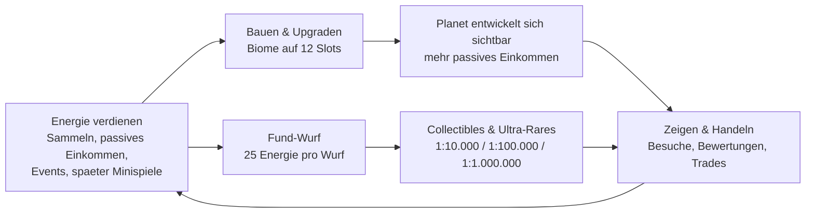

# Planet Forge – Spieldesign

Zentrales Design-Dokument. Verwandte Dokumente: [Globale Events](EVENTS.md) · [Multiplayer](MULTIPLAYER.md) · [Monetarisierung](MONETARISIERUNG.md) · [Technische Architektur](ARCHITEKTUR.md) · [Roadmap](ROADMAP.md)

Alle Zahlen in diesem Dokument sind Canon und identisch mit den Werten in `src/shared/Config/` (insbesondere `GameConfig.luau`, `BiomeConfig.luau`, `RarityConfig.luau`). Balancing-Aenderungen passieren zuerst in den Config-Dateien und werden hier nachgezogen – nie umgekehrt divergierend.

---

## 1. Vision

Jeder Spieler besitzt einen kleinen schwebenden Planeten – anfangs ein kahler Felsen. Durch Spielen sammelt er Energie und verwandelt den Felsen Schritt fuer Schritt in eine lebendige Welt: Waelder, Ozeane, Vulkane, kosmische Ebenen, Tiere, Pflanzen, Gebaeude. Der Fortschritt ist nicht eine Zahl auf einem Zaehler, sondern ein Ort, den man ansehen, besuchen und vorzeigen kann.

Kernversprechen: **Du erschaffst eine einzigartige, sichtbare Welt – kein Konto voller abstrakter Werte.** Permanenter Fortschritt, Sammeln mit echter Seltenheit, Kreativitaet, Social Features, Handel und serverweite Live-Events. Extrem seltene Funde (1:10.000, 1:100.000, 1:1.000.000) liefern Momente, die viral tauglich sind fuer TikTok und YouTube Shorts.

### Drei Design-Saeulen

| Saeule | Aussage | Konsequenz im Design |
|---|---|---|
| **Eigene lebendige Welt** | Der Planet ist der Fortschrittsbalken. Jede investierte Energie veraendert ihn sichtbar. | 12 klar lesbare Biom-Slots, sichtbare Ausbaustufen, kein unsichtbares Zahlen-Grinding. |
| **Sammeln & Seltenheit** | Seltenheit ist ehrlich und extrem: drei Ultra-Rares mit exakten, kommunizierten Chancen. | Fund-Wuerfe als bewusste Energie-Investition (25 Energie), handelbare Collectibles, serverweite Ankuendigung bei Ultra-Rare-Funden. |
| **Soziale Buehne** | Ein schoener Planet ist nur wertvoll, wenn ihn jemand sieht. | Besuche, Bewertungen, Wettbewerbe, Handel, Clans und gemeinsame Galaxien – siehe [Multiplayer](MULTIPLAYER.md). |

Jede neue Feature-Idee muss auf mindestens eine dieser Saeulen einzahlen, sonst fliegt sie raus.

---

## 2. Zielgruppe und Positionierung

**Primaere Zielgruppe:** Roblox-Kernspieler 9–15 Jahre, die Simulator- und Tycoon-Erfahrung mitbringen. **Sekundaer:** aeltere Sammler- und Deko-Spieler (15+), die von Handel, Seltenheit und Planeten-Aesthetik gehalten werden, sowie Content-Creator, die seltene Funde und schoene Planeten als Videomaterial nutzen.

Positionierung gegenueber typischen Roblox-Simulatoren:

| Typischer Simulator | Planet Forge |
|---|---|
| Fortschritt = groessere Zahl (Pets, Clicks, Cash) | Fortschritt = sichtbar verwandelter Planet |
| Prestige/Rebirth setzt Fortschritt zurueck | Kein Reset – der Planet waechst permanent |
| Seltenheit inflationaer (staendig neue "Mythics") | Drei feste Ultra-Rares mit ehrlichen, extremen Chancen |
| Pay-to-Win-Gamepasses (x2 Cash etc.) | Nur Kosmetik, siehe [Monetarisierung](MONETARISIERUNG.md) |
| Solo-Grind, Social nur als Leaderboard | Besuche, Handel, Clans, Wettbewerbe als Kernsystem |
| Events als Ausnahme | Globale Events als regelmaessiger Herzschlag, siehe [Events](EVENTS.md) |

---

## 3. Core Loop



Der Loop hat zwei parallele Investitionspfade fuer Energie: **Bauen** (planbar, dauerhaft, erhoeht das Einkommen) und **Fund-Wuerfe** (Glueck, Sammlung, Handelswert). Beide muenden in der sozialen Buehne, die wiederum Motivation und – ueber Handel – Ressourcen zurueck in den Loop speist.

Taktung einer typischen Session (15–30 min): aktiv Energie sammeln, 1–2 Bau-/Upgrade-Entscheidungen, eine Handvoll Fund-Wuerfe, mit etwas Glueck ein globales Event (der Scheduler prueft alle 60 s und startet mit 25 % Chance ein Event, wenn keines laeuft und das letzte mindestens 15 min zurueckliegt – im Schnitt alle ~19 min ein Event).

---

## 4. Energie-Oekonomie

Energie ist die einzige Hauptwaehrung. Keine Zweitwaehrung im Prototyp; Premium-Waehrung existiert nur fuer Kosmetik (siehe [Monetarisierung](MONETARISIERUNG.md)).

### 4.1 Quellen

| Quelle | Wert | Status |
|---|---|---|
| Start-Energie | 50 einmalig | Fertig |
| Manuelles Sammeln | 5 Energie, 6 s Cooldown (max. 50/min aktiv) | Fertig |
| Passives Biom-Einkommen | Summe aller Slot-Einkommen, alle 60 s anteilig gutgeschrieben | Fertig |
| Globale Events | Energie x1.5 bis x3 waehrend der Laufzeit, siehe [Events](EVENTS.md) | Fertig |
| Minispiele | Aktive Energie-Bursts als Skill-Belohnung | Geplant |
| Kaempfe / PvE-Bosse | Gruppen-Belohnungen, siehe [Multiplayer](MULTIPLAYER.md) | Geplant |
| Erkundung fremder Planeten | Kleine Belohnung pro Besuch (Anreiz fuer die soziale Buehne) | Geplant |
| Handel | Energie als Handelsgut zwischen Spielern | Fertig (System) |

### 4.2 Senken

| Senke | Wert |
|---|---|
| Biom bauen | 25 bis 100.000 Energie (siehe Tabelle unten) |
| Biom upgraden | baseCost x 1.75^aktuellesLevel, abgerundet |
| Fund-Wurf | 25 Energie pro Wurf |
| Kosmetik-Crafting | Geplant (spaete Senke fuer Ueberschuss-Energie im Endgame) |
| Handel | Energie als Handelsgut |

### 4.3 Biome (Canon)

| id | Anzeigename | Kosten | Freigeschaltet ab lifetimeEnergy | Basis-Energie/Minute |
|---|---|---:|---:|---:|
| `wiese` | Wiese | 25 | 0 | 1 |
| `wald` | Wald | 100 | 0 | 2 |
| `wueste` | Wueste | 250 | 500 | 4 |
| `ozean` | Ozean | 500 | 1.000 | 8 |
| `dschungel` | Dschungel | 1.000 | 2.500 | 15 |
| `eiswelt` | Eiswelt | 2.500 | 5.000 | 30 |
| `vulkan` | Vulkan | 5.000 | 10.000 | 60 |
| `pilzwald` | Pilzwald | 10.000 | 25.000 | 120 |
| `kristallfelder` | Kristallfelder | 25.000 | 50.000 | 250 |
| `kosmische_ebene` | Kosmische Ebene | 100.000 | 250.000 | 600 |

Freischaltung haengt an **lifetimeEnergy** (insgesamt jemals verdiente Energie), nicht am aktuellen Kontostand – Ausgeben bestraft also nie die Progression.

### 4.4 Upgrade-Regel

- Jedes Biom: `maxLevel = 5`, `upgradeCostMultiplier = 1.75`.
- Upgrade-Kosten von Level L auf L+1: `floor(baseCost * 1.75^L)`.
- Einkommen bei Level L: `baseEnergyPerMinute * L` (Level 5 = das Fuenffache der Basis).

Beispiel Wiese (baseCost 25): Upgrades kosten 43 / 76 / 133 / 234 Energie (Level 2–5). Beispiel Vulkan (baseCost 5.000): 8.750 / 15.312 / 26.796 / 46.894 Energie.

### 4.5 Amortisation (Beispielrechnung)

Amortisationszeit = Kosten / zusaetzliches Einkommen pro Minute (nur passives Einkommen, ohne Events und aktives Sammeln):

| Kauf | Kosten | Einkommenszuwachs | Amortisation |
|---|---:|---:|---:|
| Wiese bauen (Level 1) | 25 | +1/min | 25 min |
| Wiese Level 1 → 2 | 43 | +1/min | 43 min |
| Vulkan bauen (Level 1) | 5.000 | +60/min | ~83 min |
| Vulkan Level 1 → 2 | 8.750 | +60/min | ~146 min |

Ablesbare Balancing-Absicht: Frueh dominiert aktives Sammeln (bis 50/min), passives Einkommen dominiert ab Mittelspiel. Amortisationszeiten steigen mit dem Tier – hoehere Biome sind Commitment, keine No-Brainer. Upgrades sind pro Biom degressiv (jedes weitere Level amortisiert langsamer), was Vielfalt (neue Biome bauen) gegenueber Mono-Maxing attraktiv haelt.

---

## 5. Planet und Slots

Jeder Planet hat exakt **12 Biom-Slots** (`GameConfig.PLANET_SLOTS`), gleichmaessig ueber die Planetenoberflaeche verteilt.

Warum Slots statt freiem Terraforming:

- **Lesbarer Fortschritt:** "8 von 12 Slots gefuellt" versteht jeder auf einen Blick – der eigene Fortschritt und der eines besuchten Planeten.
- **Klare Bauentscheidungen:** Mit begrenzten Slots ist jede Platzierung eine echte Entscheidung (Welches Biom? Bauen oder upgraden?), statt beliebigem Zukleistern.
- **Technisch beherrschbar:** Slots lassen sich als kompakte Datenstruktur speichern, replizieren und auf fremden Planeten schnell laden (siehe [Architektur](ARCHITEKTUR.md)).
- **Vergleichbarkeit:** Wettbewerbe um den schoensten Planeten (siehe [Multiplayer](MULTIPLAYER.md)) brauchen eine vergleichbare Grundflaeche.

Sichtbarkeit des Fortschritts: Jedes gebaute Biom veraendert den Planeten sofort sichtbar (Terrain, Farben, Props); Level-Ups verdichten das Biom (mehr Vegetation, groessere Strukturen, Partikeleffekte ab Level 3+). Ziel: Ein Screenshot des Planeten erzaehlt ohne UI, wie weit der Spieler ist.

**Spaetere Ausbaustufe – Planeten-Look:** Der Planet selbst bekommt globale Ausbaustufen (Atmosphaere, Wolken, Ringe, Monde), gekoppelt an Meilensteine wie Anzahl gefuellter Slots und Gesamt-Level. Kosmetische Skins darauf (Farbpaletten, Wettereffekte) sind Monetarisierungsflaeche, siehe [Monetarisierung](MONETARISIERUNG.md). Nicht Teil des Prototyps, siehe [Roadmap](ROADMAP.md).

---

## 6. Funde und Seltenheit

### 6.1 Fund-Wurf-Mechanik

Ein Fund-Wurf kostet **25 Energie** und laeuft serverseitig in zwei Stufen:

1. **Ultra-Rare-Pruefung:** Die drei Ultra-Rares werden einzeln gewuerfelt, seltenste zuerst (Kosmischer Kern → Goldener Drache → Leuchtender Kristall). Trifft einer, endet der Wurf sofort mit diesem Fund.
2. **Tier-Wurf:** Trifft kein Ultra-Rare, wird ueber die gewichtete Tier-Tabelle ein Seltenheits-Tier bestimmt und daraus ein Collectible gezogen.

### 6.2 Tier-Tabelle (normaler Pool)

| Tier | Gewicht | Anteil |
|---|---:|---:|
| Common | 60 | 60 % |
| Uncommon | 25 | 25 % |
| Rare | 10 | 10 % |
| Epic | 4 | 4 % |
| Legendary | 1 | 1 % |
| Mythic | 0 | nur Ultra-Rare-Wurf |
| Cosmic | 0 | nur Ultra-Rare-Wurf |

Mythic und Cosmic sind bewusst **nicht** im normalen Pool: Ihre Seltenheit soll nicht durch Wurf-Volumen verwaessert werden.

### 6.3 Ultra-Rares (Canon)

| collectibleId | Name | Chance | Tier | Erwartete Energie bis Fund* |
|---|---|---:|---|---:|
| `kristall` | Leuchtender Kristall | 1 : 10.000 | Legendary | ~250.000 |
| `goldener_drache` | Goldener Drache | 1 : 100.000 | Mythic | ~2,5 Mio. |
| `kosmischer_kern` | Kosmischer Kern | 1 : 1.000.000 | Cosmic | ~25 Mio. |

\* Erwartungswert bei 25 Energie pro Wurf ohne Loot-Glueck – bewusst so extrem, dass Handel (siehe [Multiplayer](MULTIPLAYER.md)) und Event-Fenster der realistische Weg zu Mythic/Cosmic sind. Jeder Ultra-Rare-Fund wird serverweit angekuendigt.

### 6.4 Loot-Glueck aus Events

Globale Events (siehe [Events](EVENTS.md)) liefern einen Loot-Glueck-Multiplikator, der die Ultra-Rare-Chancen verbessert:

```
effektive Chance = oneIn(max(1, math.floor(n / lootLuckMultiplier)))
```

Beispiele: Waehrend **Meteoritenschauer** (Glueck x3) faellt der Kristall von 1:10.000 auf 1:3.333; waehrend **Seltene Kreaturen** (Glueck x5) auf 1:2.000, der Goldene Drache auf 1:20.000 und der Kosmische Kern auf 1:200.000. Event-Fenster sind damit die klaren "Jetzt wuerfeln!"-Momente des Spiels.

### 6.5 Offene Designfrage: Pity-System

Reines Glueck kann lange Frust-Strecken erzeugen (ca. 36 % der Spieler sehen in 20 Wuerfen kein einziges Epic+). **Empfehlung:** Soft-Pity nur fuer den normalen Pool – garantiertes Epic (oder besser) nach 50 Wuerfen ohne Epic+, Zaehler wird bei jedem Epic+-Fund zurueckgesetzt und persistiert im Profil. Ultra-Rares bekommen **kein** Pity: Ihre Chancen bleiben ehrlich und extrem, sonst verlieren die 1:1.000.000 ihre Bedeutung als Serverereignis. Entscheidung faellt nach Prototyp-Telemetrie, siehe [Roadmap](ROADMAP.md).

---

## 7. Progression und Retention

### 7.1 Erste Session (Minute 1–15)

| Zeit | Erlebnis |
|---|---|
| Min 1–2 | Spawn auf dem eigenen kahlen Felsen, 50 Start-Energie. Tutorial-Prompt: erstes manuelles Sammeln (5 Energie / 6 s). |
| Min 2–3 | Erste Wiese bauen (25) – der Planet veraendert sich zum ersten Mal sichtbar, passives Einkommen startet. |
| Min 4–6 | Erster Fund-Wurf (25) – die Sammel-Mechanik und die Tier-Leiter werden erlebbar. |
| Min 6–12 | Auf den Wald sparen (100), zweiter Slot fuellt sich. Nebenbei: Anzeige der naechsten Freischaltungen (Wueste ab 500 lifetimeEnergy). |
| Min 12–15 | Erster Besuch eines Nachbarplaneten oder erstes globales Event – die soziale bzw. Live-Dimension zeigt sich. |

Ziel: In den ersten 15 Minuten hat der Spieler alle drei Saeulen einmal beruehrt – gebaut, gewuerfelt, gesehen was moeglich ist.

### 7.2 Tag 1–7

Wueste, Ozean und Dschungel schalten sich ueber lifetimeEnergy frei (500 / 1.000 / 2.500), erste Upgrades werden rentabel, erste Rare/Epic-Funde landen in der Sammlung. Erste Trades mit anderen Spielern, erste Events aktiv miterlebt. Ziel Ende Woche 1: 6–8 gefuellte Slots, Eiswelt (ab 5.000) in Reichweite, mindestens ein Epic in der Sammlung.

### 7.3 Woche 2+

Vulkan bis Kristallfelder als Mittelfrist-Ziele, Slot-Optimierung (welches Biom ersetzt/upgraded man), gezieltes Wuerfeln in Event-Fenstern, Handel als eigenes Metagame (Sammlung komplettieren, Werte tauschen). Clans und Galaxie-Bau binden Spieler sozial, Wettbewerbe geben Deko-Investitionen einen Anlass – siehe [Multiplayer](MULTIPLAYER.md).

### 7.4 Taegliche Anreize

- **Globale Events** als unplanbare "Jetzt einloggen lohnt sich"-Momente – im Schnitt alle ~19 min eines, serverweit fuer alle gleichzeitig ([Events](EVENTS.md)).
- **Passives Einkommen** macht jeden Login wertvoll (Bauentscheidung mit aufgelaufener Energie). Offline-Einkommen: offene Designfrage, siehe Abschnitt 8.
- **Geplant:** Daily Quests (3 Aufgaben/Tag, z. B. "10 Fund-Wuerfe", "2 Planeten besuchen"), Login-Streaks mit Kosmetik-Belohnungen, woechentliche Wettbewerbe.

### 7.5 Langzeitziele

1. **Kosmische Ebene** (100.000 Energie, ab 250.000 lifetimeEnergy) – das Prestige-Biom, sichtbar von weitem.
2. **Voll ausgebauter Planet** – 12 Slots, alles Level 5.
3. **Kosmischer Kern** (1:1.000.000) – das seltenste Objekt des Spiels, ob erwuerfelt oder erhandelt.
4. **Galaxien mit dem Clan bauen** und Wettbewerbe gewinnen ([Multiplayer](MULTIPLAYER.md)).
5. **Battle Pass und Kosmetik-Sammlung** als saisonale Ziele ([Monetarisierung](MONETARISIERUNG.md)).

---

## 8. Offene Designfragen

| Frage | Prototyp-Antwort | Spaeter (Kandidat) |
|---|---|---|
| Minispiele als Energie-Quelle? | Nein – nur Sammeln, passives Einkommen, Events. | 2–3 Minispiele als aktive Energie-Bursts mit Skill-Anteil (Meteoriten fangen, Kristall-Puzzle). |
| Kaempfe / PvE-Bosse? | Nein. | Serverweite Bosse waehrend Alien-Invasion, Gruppen-Loot – Design in [Multiplayer](MULTIPLAYER.md). |
| Planetengroesse fix? | Ja, eine Groesse, 12 Slots. | Groessenstufen als sichtbare Meilensteine; Slot-Anzahl bleibt 12, Slots werden groesser. |
| Terraforming frei vs. Slots? | Slots (siehe Abschnitt 5). | Deko-Layer: frei platzierbare kosmetische Props **innerhalb** der Slots, Biom-Logik bleibt Slot-basiert. |
| Gleiches Biom mehrfach baubar? | Ja, keine Duplikat-Sperre (einfachste Regel). | Sanfter Diversitaets-Bonus (z. B. +5 % Einkommen pro unterschiedlichem Biom) statt Verbot. |
| Pity-System fuer Fund-Wuerfe? | Nein, reines Glueck. | Soft-Pity: garantiertes Epic+ nach 50 Wuerfen ohne Epic+, kein Pity fuer Ultra-Rares (Abschnitt 6.5). |
| Offline-/AFK-Einkommen? | Nein, Einkommen nur bei Anwesenheit (alle 60 s). | Gedeckeltes Offline-Einkommen (z. B. max. 8 h zu 50 %) als Retention-Feature. |
| Biome entfernen/verschieben? | Ueberbauen erlaubt (alter Slot-Inhalt verfaellt ersatzlos). | Verschieben gratis, Abriss mit Teil-Erstattung (50 % der investierten Energie). |

Priorisierung und Zeitpunkte dieser Entscheidungen: siehe [Roadmap](ROADMAP.md).
