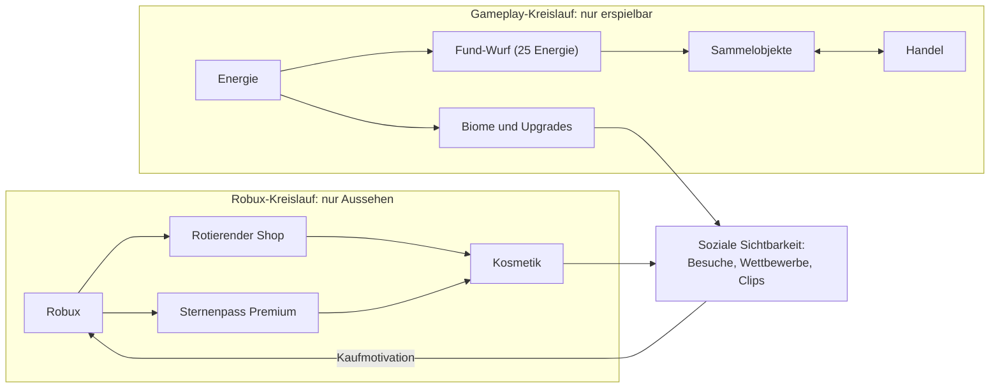

# Planet Forge – Monetarisierung

> **⚠️ Kurswechsel (aktueller Stand):** Das Spiel nutzt inzwischen eine
> Simulator-übliche Kauf-Kette mit Währungspaketen, Sofort-Wiedergeburt und
> Perk-Gamepässen (2x Multiplikator, +2 Pet-Slots, VIP) – siehe
> `MonetizationConfig.luau` und README. Die folgenden Kapitel beschreiben das
> ursprüngliche Nur-Kosmetik-Konzept und gelten als Design-Archiv.

Monetarisierungsdesign ohne Pay-to-Win. Verwandte Dokumente: [Spieldesign](GAME_DESIGN.md) · [Globale Events](EVENTS.md) · [Multiplayer](MULTIPLAYER.md) · [Technische Architektur](ARCHITEKTUR.md) · [Roadmap](ROADMAP.md)

Alle Gameplay-Zahlen in diesem Dokument (Fund-Wurf-Kosten, Ultra-Rare-Chancen, Slots) sind Canon und identisch mit `src/shared/Config/GameConfig.luau` und `src/shared/Config/RarityConfig.luau`. Robux-Preise sind Zielspannen und werden in der Beta kalibriert (siehe Abschnitt 7).

---

## 1. Grundsatz-Manifest

**Bezahlt wird nur Aussehen – niemals Fortschritt, niemals Chancen.**

Planet Forge verkauft ausschließlich Dinge, die man sieht: Skins, Effekte, Haustiere, Emotes. Kein Robux-Kauf verändert, wie schnell ein Spieler Energie sammelt, was er würfelt oder was er bauen kann. Ein Spieler, der nie einen Robux ausgibt, hat exakt dieselben Gameplay-Möglichkeiten wie der größte Käufer – er sieht nur anders aus.

Der Grund ist nicht nur Ethik, sondern Produktlogik: Das Kernversprechen des Spiels ist "jeder Planet ist eine echte, selbst erarbeitete Welt" ([Spieldesign](GAME_DESIGN.md)). In dem Moment, in dem Fortschritt kaufbar wird, verliert jeder Planet seinen Beweiswert – auch die der Nicht-Käufer. Kosmetik dagegen macht Planeten unterscheidbarer und stärkt das Kernversprechen.

### 1.1 Verbotsliste (nicht verhandelbar)

| # | Verboten | Begründung |
|---|---|---|
| 1 | **Kaufbare Energie** – kein direkter Kauf, keine Robux-Pakete, keine "Starter-Bundles" mit Energie | Energie ist die einzige Fortschrittswährung. Kaufbare Energie = kaufbare Biome = Pay-to-Win. |
| 2 | **Kaufbare Fund-Würfe** – Würfe kosten immer 25 erspielte Energie (`LOOT_ROLL_COST`), nie Robux | Sonst entsteht eine bezahlte Zufallsmechanik (Lootbox), siehe Abschnitt 6. |
| 3 | **Kaufbare Loot-Chancen-Boosts** – kein Robux-Produkt erhöht Loot-Glück oder Ultra-Rare-Chancen | Die Chancen 1:10.000 / 1:100.000 / 1:1.000.000 gelten für alle gleich. Loot-Glück kommt ausschließlich aus [globalen Events](EVENTS.md), die für alle gleichzeitig wirken. |
| 4 | **Handel Robux gegen Items** – kein Verkauf von Sammelobjekten oder Energie gegen Robux, weder durch uns noch als geduldeter Spieler-Schwarzmarkt | Der Handel ([Multiplayer](MULTIPLAYER.md)) ist eine reine In-Game-Ökonomie (Items + Energie). Robux-Beteiligung würde Real-Money-Trading legitimieren und die Sammlerwerte zerstören. |
| 5 | **Kaufbare Event-Multiplikatoren** – keine individuelle Verlängerung oder Auslösung globaler Events | Events wirken immer für alle gleich (Regel 6 in [EVENTS.md](EVENTS.md)). |
| 6 | **Kaufbare Wettbewerbs-Vorteile** – keine kaufbaren Stimmen, keine bezahlte Platzierung im "Schönster Planet"-Wettbewerb | Wettbewerbs-Prestige ist die soziale Bühne, auf der Kosmetik ihren Wert bekommt (Abschnitt 7). Kaufbares Prestige entwertet die Bühne. |

Die beiden Ökonomien sind vollständig getrennt – es gibt bewusst keine Kante von Robux in den Gameplay-Kreislauf:

---

## 2. Kosmetik-Katalog

Fünf Kategorien, alle rein visuell, alle in der Planeten-Vorschau vor dem Kauf anprobierbar. Preisspannen orientieren sich an marktüblichen Roblox-Kosmetikpreisen; finale Preise werden in der Beta getestet (Abschnitt 7).

### 2.1 Planeten-Skins (Kern-Texturen, Ringe, Monde)

Der Planet ist das Profilbild des Spielers – Skins sind die wertvollste Kategorie, weil jeder Besucher sie sieht.

| Beispiel | Typ | Robux-Spanne |
|---|---|---:|
| Marmorkern | Kern-Textur, statisch | 150–300 |
| Lavakern | Kern-Textur, animiert (glühende Adern) | 400–600 |
| Eisring | Planetenring, statisch | 250–400 |
| Prisma-Doppelring | Planetenring, animiert, lichtbrechend | 500–800 |
| Kleiner Begleiter | Mond, umkreist den Planeten | 300–500 |
| Zwillingsmonde | Zwei Monde mit gekoppelter Umlaufbahn | 600–1.000 |

### 2.2 Wettereffekte

Dauerhafte, an- und abschaltbare Atmosphären-Effekte über dem eigenen Planeten. Nicht zu verwechseln mit den temporären Event-Effekten aus [EVENTS.md](EVENTS.md) – gekaufte Wettereffekte haben nie Gameplay-Wirkung.

| Beispiel | Beschreibung | Robux-Spanne |
|---|---|---:|
| Sanfter Nebel | Bodennaher Nebelschleier in Biom-Tälern | 150–250 |
| Regenbogenschauer | Kurzer Regen mit anschließendem Regenbogen, per Klick auslösbar | 200–350 |
| Sternschnuppen-Nacht | Vereinzelte Sternschnuppen am Nachthimmel des Planeten | 300–500 |
| Aurora | Polarlicht-Band über den kalten Biomen (Eiswelt, Kristallfelder) | 400–700 |

### 2.3 Haustiere

Rein dekorative Begleiter, die dem Spieler folgen – auch beim Besuch fremder Planeten (mobile Werbefläche). Haustiere sammeln nichts, boosten nichts, kämpfen nicht. Klare Abgrenzung: kosmetische Haustiere sind **keine** Sammelobjekte und nicht handelbar; die drei Ultra-Rares (Kristall, Goldener Drache, Kosmischer Kern) bleiben ausschließlich erspielbar.

| Beispiel | Beschreibung | Robux-Spanne |
|---|---|---:|
| Mini-Komet | Kleiner Feuerschweif, kreist um den Spieler | 250–400 |
| Nebelqualle | Schwebt langsam hinterher, pulsiert farbig | 400–600 |
| Sternenfuchs | Läuft neben dem Spieler, Idle-Animationen | 500–800 |
| Funkeldrache | Baby-Drache mit Glitzer-Partikeln (bewusst visuell klar vom erspielbaren Goldenen Drachen unterschieden) | 800–1.200 |

### 2.4 Emotes und Animationen

| Beispiel | Beschreibung | Robux-Spanne |
|---|---|---:|
| Sternengruß | Winken mit Partikel-Sternchen | 50–100 |
| Planeten-Stolz | Pose, die auf den eigenen Planeten zeigt | 75–150 |
| Schwerelos | Kurze Zero-G-Loop-Animation | 100–200 |
| Sieger-Feuerwerk | Jubel-Emote mit Mini-Feuerwerk | 150–250 |

### 2.5 Bau-Effekte

Partikel- und Sound-Varianten beim Platzieren und Upgraden von Biomen – der Moment, den Besucher und Zuschauer am häufigsten sehen (TikTok-Baumontagen).

| Beispiel | Beschreibung | Robux-Spanne |
|---|---|---:|
| Blütenwirbel | Blütenblätter-Explosion beim Platzieren | 100–150 |
| Blitzschlag | Biom erscheint mit Gewitterblitz | 150–250 |
| Sternenstaub-Spirale | Goldene Spirale zieht sich beim Upgrade zusammen | 200–300 |

---

## 3. Battle Pass: der Sternenpass

### 3.1 Eckdaten

| Parameter | Wert |
|---|---|
| Saisonlänge | ~8 Wochen |
| Stufen | 30 |
| Tracks | Gratis (für alle) + Premium (Kosmetik-only) |
| Premium-Preis | 499 Robux (Zielwert, Beta-Kalibrierung) |
| Stufen-Fortschritt | Sternenpunkte (SP) aus Spielaktivität, 800 SP pro Stufe |
| Stufen-Skips | **Nicht kaufbar** (siehe 3.4) |

### 3.2 Track-Regeln

- **Gratis-Track:** darf Energie enthalten – Energie ist die frei erspielbare Kernwährung, ein Gratis-Track-Bonus ist funktional identisch mit einer Spielaktivitäts-Belohnung und für niemanden kaufbar (der Gratis-Track kostet nichts, und Stufen sind nicht kaufbar). Insgesamt ~3.250 Energie über die Saison – spürbar für Einsteiger, irrelevant gegen die 100.000 der Kosmischen Ebene. Keine exklusiven Gameplay-Vorteile: keine Loot-Boosts, keine Extra-Slots (es bleibt bei 12), keine exklusiven Biome.
- **Premium-Track:** enthält **ausschließlich Kosmetik** – bewusst null Energie, damit der Kauf des Passes nachweisbar keinerlei Fortschritt kauft. Das Saison-Highlight (animierter Planeten-Skin auf Stufe 30) kehrt nicht in den Shop zurück und ist das Prestige-Argument des Passes.

### 3.3 Beispiel-Belohnungstabelle Saison 1 (gekürzt)

| Stufe | Gratis | Premium (nur Kosmetik) |
|---:|---|---|
| 1 | 100 Energie | Emote "Sternengruß" (Saison-Variante) |
| 2 | Profiltitel "Sternwanderer" | Bau-Effekt "Kometenschweif" |
| 3 | 150 Energie | Wettereffekt "Leichter Sternenstaub" |
| 5 | Bau-Effekt "Funken" (einfach) | Kern-Textur "Basaltkern poliert" |
| 10 | 250 Energie | Haustier "Glimmerfalter" |
| 15 | Emote "Daumen hoch, Planet!" | Planetenring "Saisonring Silber" |
| 20 | 400 Energie | Wettereffekt "Sternschnuppen-Brise" |
| 25 | 500 Energie | Mond "Saisonmond mit Kraterleuchten" |
| 29 | 550 Energie | Emote "Sieger-Feuerwerk" (Saison-Färbung) |
| 30 | Profiltitel "Sternenpass-Vollender S1" | **Animierter Planeten-Skin "Geburt eines Sterns"** (Saison-exklusiv) |

Zwischenstufen (4, 6–9, 11–14, …) füllen das Raster mit kleinen Energie-Paketen (Gratis) und Farbvarianten/Emotes (Premium) nach demselben Muster.

### 3.4 Fortschritt über Spielaktivität

Sternenpunkte kommen aus dem normalen Spielen – der Pass belohnt die Loop-Aktivitäten aus dem [Spieldesign](GAME_DESIGN.md), statt eigene Grind-Aufgaben zu erfinden:

| Aktivität | SP | Tages-Cap |
|---|---:|---:|
| Erster Login des Tages | 50 | 1x |
| Manuelles Sammeln | 1 pro Einsammeln | 100 SP |
| Biom kaufen oder upgraden | 25 | – |
| Fund-Wurf (25 Energie) | 5 | – |
| Globales Event aktiv miterlebt (mind. halbe Dauer online) | 150 | – |
| Fremden Planeten besucht | 20 | 100 SP |
| Handel abgeschlossen | 25 | 50 SP |
| Wettbewerbs-Teilnahme ([Multiplayer](MULTIPLAYER.md)) | 200 | 1x pro Woche |

Rechnung: 30 Stufen x 800 SP = 24.000 SP in ~56 Tagen ≈ 430 SP/Tag. Ein täglicher Spieler mit 30–60 Minuten (Login, Sammel-Cap, ein Event, ein paar Besuche und Käufe) liegt bei ~500–600 SP/Tag und schließt den Pass mit 1–2 Wochen Puffer ab. Wer nur 4–5 Tage pro Woche spielt, schafft Stufe 30 knapp – der Pass soll ohne Druck beendbar sein, deshalb gibt es **keine kaufbaren Stufen-Skips**: Sie wären der Einstieg in "Zeitdruck erzeugen, Auflösung verkaufen" (Dark Pattern, Abschnitt 6.2).

Käuferfreundlich: Der Premium-Track kann **jederzeit in der Saison** gekauft werden und schaltet rückwirkend alle bereits erreichten Premium-Belohnungen frei. Es gibt keinen Grund, früh unter Unsicherheit zu kaufen – wer erst in Woche 7 überzeugt ist, verliert nichts.

---

## 4. Verkaufsflächen

### 4.1 Rotierender Shop

- **Täglich:** 2 Slots (kleine Items: Emotes, Bau-Effekte, günstige Wettereffekte).
- **Wöchentlich:** 2 Slots (große Items: Skins, Ringe, Monde, Haustiere).
- **Rotationsregel:** Jedes Shop-Item kehrt spätestens nach 8 Wochen zurück. Der Shop zeigt das offen an ("kehrt zurück") – Rotation strukturiert das Angebot, sie inszeniert keine Verknappung. Kein "letzte Chance"-Messaging, kein Countdown im Kaufdialog (Abschnitt 6.2).

### 4.2 Event-Kosmetik

Während [globaler Events](EVENTS.md) zeigt der Shop passende Kosmetik: Aurora-Effekte beim Schwarzen Loch, Meteor-Bau-Effekte beim Meteoritenschauer. Regeln: Die Items sind **kaufbar, solange das Event läuft, und kehren beim nächsten Event desselben Typs zurück** – Event-Bindung schafft thematische Kaufmomente (der Himmel brennt, der passende Skin ist im Shop), aber kein "für immer weg". Die Event-Multiplikatoren selbst bleiben unverkäuflich (Verbotsliste #5).

### 4.3 Wettbewerbs-Preise (nicht kaufbar)

Gewinner der "Schönster Planet"-Wettbewerbe ([Multiplayer](MULTIPLAYER.md)) erhalten limitierte Kosmetik (z. B. goldener Sieger-Ring mit Saisonnummer), die **niemals verkauft** wird. Das ist bewusster Verzicht auf Umsatz: Nicht kaufbares Prestige beweist, dass Aussehen im Spiel etwas bedeutet – und genau dieser Beweis macht kaufbare Kosmetik wertvoll. Ein Spiel, in dem alles kaufbar ist, hat keine Statussymbole.

---

## 5. Was Kosmetik technisch nie darf

Damit "nur Aussehen" überprüfbar bleibt, gilt für jede Kosmetik-Implementierung ([Architektur](ARCHITEKTUR.md)):

1. Kosmetik-Daten leben in einem eigenen Profilbereich, getrennt von Energie, Biomen und Sammelobjekten.
2. Kein Server-System (Energie, Loot, Events, Handel) liest Kosmetik-Besitz. Code-Review-Regel: Ein Import von Kosmetik-Daten in `EnergyService`, `LootService` oder `TradeService` ist ein Bug.
3. Kosmetik ist nicht handelbar (Verbotsliste #4) – sie ist an den Account gebunden. Handelbar sind nur erspielte Sammelobjekte und Energie.
4. Käufe laufen über `ProcessReceipt` mit idempotenter Gutschrift; fehlgeschlagene Gutschriften werden serverseitig nachgeholt, nie zulasten des Käufers.

---

## 6. Compliance und Ethik

### 6.1 Roblox-Richtlinien: Paid Random Items

Roblox verlangt für bezahlte Zufallsinhalte (Paid Random Items) u. a. die Offenlegung der Chancen und stellt zusätzliche regulatorische Anforderungen (Lootbox-Gesetzgebung in mehreren Ländern). Planet Forge geht einen Schritt weiter und **hat schlicht keine bezahlten Zufallsinhalte**:

- Fund-Würfe kosten ausschließlich 25 **erspielte** Energie. Es existiert kein Robux-Produkt, das Energie, Würfe oder Wurf-Chancen liefert – damit gibt es keine Kauf-zu-Zufall-Kette, auch keine indirekte.
- Alle Robux-Käufe sind deterministisch: Der Spieler sieht vor dem Kauf exakt das Item, das er bekommt, inklusive Live-Vorschau auf dem eigenen Planeten. Keine kosmetischen Lootboxen, keine "Mystery-Kapseln".
- Die Ultra-Rare-Chancen werden trotzdem offen im Spiel angezeigt: Der Fund-Wurf-Dialog nennt permanent 1:10.000 (Leuchtender Kristall), 1:100.000 (Goldener Drache), 1:1.000.000 (Kosmischer Kern) sowie den aktuell wirkenden Event-Loot-Glück-Multiplikator. Transparenz ist hier keine Pflicht (es fließt kein Geld), sondern Vertrauensaufbau.

### 6.2 Junge Zielgruppe: klare Preise, keine Dark Patterns

Die Kernzielgruppe ist 9–14 ([Spieldesign](GAME_DESIGN.md)). Daraus folgen harte UI-Regeln:

| Regel | Konkret |
|---|---|
| Klare Preise | Jedes Item zeigt seinen Robux-Preis direkt am Item, keine Zwischenwährung ("Gems"), keine Bundle-Verschleierung. |
| Kein Timer-Druck beim Kauf | Kaufdialoge enthalten keine Countdowns, kein "Nur noch heute!". Die Shop-Rotation ist sichtbar, aber der Kaufdialog selbst ist zeitlich neutral. |
| Kein FOMO-Design | Alles Rotierende kehrt zurück (max. 8 Wochen, angezeigt). Einzige dauerhafte Exklusive: Sternenpass-Stufe-30-Skins und Wettbewerbs-Preise – beides wird nie als "jetzt kaufen oder verlieren" beworben (der Pass ist die ganze Saison kaufbar und rückwirkend). |
| Keine Kaufaufforderungen im Gameplay | Kein Popup nach verlorener Gelegenheit, kein "Mit Robux weitermachen". Der Shop wird aktiv geöffnet, er öffnet sich nie selbst. |
| Vorschau vor Kauf | Jede Kosmetik ist vollständig am eigenen Planeten/Avatar anprobierbar, bevor Robux fließen. |

### 6.3 Eltern-Perspektive

Prüffrage für jedes neue Produkt: **"Kann ein Elternteil in 30 Sekunden verstehen, was gekauft wurde – und dass es keinen Spielvorteil bringt?"** Wenn nein, wird das Produkt nicht gebaut. Praktisch heißt das: sprechende Item-Namen im Kaufbeleg, eine öffentliche "Was kann man kaufen?"-Seite mit dem Manifest aus Abschnitt 1, und die garantierte Aussage: Ausgaben ändern nichts am Fortschritt des Kindes – ein Konto ohne Käufe ist spielerisch vollwertig.

---

## 7. Umsatz-Logik und Beta-Zielkorridore

### 7.1 Warum Kosmetik hier funktioniert

Kosmetik verkauft sich proportional zur **sozialen Sichtbarkeit** – und Planet Forge ist als Schaufenster gebaut:

1. **Besuche:** Jeder Planet ist begehbar ([Multiplayer](MULTIPLAYER.md)). Skins, Ringe, Monde und Wettereffekte sind für jeden Besucher sichtbar, Haustiere reisen sogar auf fremde Planeten mit.
2. **Wettbewerbe:** Der wöchentliche "Schönster Planet"-Wettbewerb macht Aussehen zur Rangliste. Kosmetik ist dort legitimes Gestaltungsmittel (kaufbare Stimmen bleiben verboten, Verbotsliste #6).
3. **Clips:** Events und Bau-Momente sind auf TikTok/Shorts-Tauglichkeit designt ([EVENTS.md](EVENTS.md)) – jeder virale Clip zeigt den kosmetischen Zustand eines Planeten und wirkt als Produktvorführung.

Dieselbe Sichtbarkeit diszipliniert das Design: Weil jeder Planet öffentlich ist, würde Pay-to-Win sofort auffallen und das Vertrauen zerstören, von dem der Kosmetik-Umsatz lebt.

### 7.2 Zielkorridore für die Beta

Referenzwerte erfolgreicher Kosmetik-only-Titel dienen als Hypothesen, nicht als Versprechen – validiert wird in der offenen Beta ([Roadmap](ROADMAP.md)):

| Metrik | Beta-Zielkorridor | Anmerkung |
|---|---|---|
| Payer-Conversion (Anteil zahlender MAU) | 2–4 % | Kosmetik-only liegt naturgemäß unter Gacha-Titeln; unter 1,5 % → Sichtbarkeits- oder Katalogproblem. |
| ARPPU | 300–600 Robux/Monat | Getrieben von Sternenpass (499) + 1–2 Shop-Käufen bei aktiven Zahlern. |
| Sternenpass-Kaufquote (Anteil an D7-aktiven Spielern) | 5–10 % | Wichtigster Einzelhebel; rückwirkende Freischaltung (3.4) macht späte Käufe messbar. |
| Umsatz-Mix | ~45 % Pass / ~50 % Shop / Rest Sonstiges | Erwartung, kein Ziel – starke Abweichung steuert die Katalog-Planung. |
| Erstkauf-Zeitpunkt | Median nach Tag 7+ | Früher Erstkauf-Peak (Tag 1–2) wäre ein Warnsignal für unbeabsichtigten Kaufdruck beim Onboarding. |

Gemessen wird pro Kohorte (siehe Analytics-Setup in der [Architektur](ARCHITEKTUR.md)); Preisanpassungen passieren zwischen Saisons, nie innerhalb einer laufenden Saison.

### 7.3 Bewusst ausgelassene Umsatzquellen

Zur Klarheit, was trotz Branchenüblichkeit **nicht** kommt: Energie-Pakete, Zeit-Skips, kosmetische Lootboxen, kaufbare Battle-Pass-Stufen, Handelsgebühren in Robux, "VIP-Gamepasses" mit Einkommens-Boni. Jede dieser Quellen würde kurzfristig Umsatz bringen und langfristig das Kernversprechen beschädigen. Die Wette dieses Dokuments: Ein glaubwürdiges "nur Aussehen" erzeugt über Vertrauen, Sichtbarkeit und Saison-Rhythmus mehr Lifetime-Umsatz als jede dieser Abkürzungen.

---

## 8. Umsetzung im Code (Stand P0)

Der erste Ausbau des Robux-Shops ist im Skeleton implementiert:

| Baustein | Datei | Inhalt |
|---|---|---|
| Katalog & Produkt-IDs | `src/shared/Config/MonetizationConfig.luau` | 10 Kosmetiken in 4 Kategorien (Planeten-Skins, Auren, Wettereffekte, Haustiere), 3 Gamepässe, 4 Developer Products. |
| Server-Logik | `src/server/Services/MonetizationService.luau` | Gamepass-Prüfung beim Beitritt (`UserOwnsGamePassAsync`), Kauf im Spiel (`PromptGamePassPurchaseFinished`), idempotentes `ProcessReceipt` für Developer Products, `EquipCosmetic`-Validierung, Haustier-Begleiter. |
| Sichtbare Effekte | `src/server/Services/PlanetService.luau` (`applyCosmetics`) | Skins ändern Material/Farbe/Glow des Planetenkerns, Auren und Wetter sind ParticleEmitter am Plot – für jeden Besucher sichtbar. |
| Shop-UI | `src/client/Controllers/ShopController.luau` | Shop-Panel mit Preisanzeige (`GetProductInfo`), offiziellen Roblox-Kaufdialogen und "Meine Kosmetik" zum Ausrüsten. Fairness-Hinweis fest im Panel. |

**Einrichtung:** Die IDs in `MonetizationConfig.luau` sind Platzhalter (`0`). Im Roblox Creator Dashboard unter *Monetarisierung* die drei Gamepässe und vier Developer Products anlegen und die echten IDs eintragen – bis dahin zeigt der Shop die Einträge als "Bald..." und deaktiviert den Kauf.

**Eingebaute Fairness-Garantien (überprüfbar im Code):** `MonetizationService` vergibt ausschließlich Einträge aus dem Kosmetik-Katalog – es existiert kein Codepfad von Robux zu Energie, Fund-Würfen oder Loot-Chancen. Kosmetik liegt in eigenen Profilfeldern (`ownedCosmetics`/`equippedCosmetics`), die von `EnergyService`, `LootService` und `TradeService` nicht gelesen werden (Regel aus Abschnitt 5). Kosmetik ist nicht handelbar.

Noch offen für spätere Phasen: Live-Vorschau vor dem Kauf, rotierender Shop (4.1), Event-Kosmetik (4.2) und der Sternenpass (Abschnitt 3).
