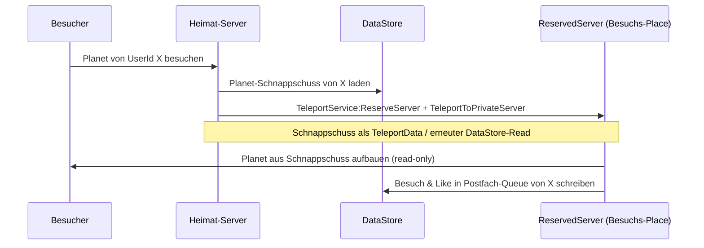
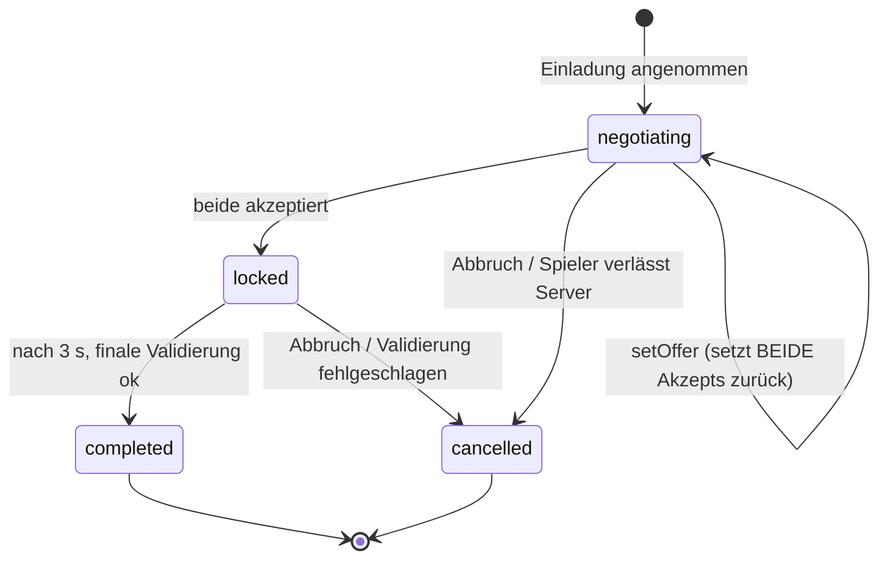

# Planet Forge – Multiplayer und Social-Design

Verwandte Dokumente: [Spieldesign](GAME_DESIGN.md) · [Globale Events](EVENTS.md) · [Monetarisierung](MONETARISIERUNG.md) · [Technische Architektur](ARCHITEKTUR.md) · [Roadmap](ROADMAP.md)

Alle Zahlen sind Canon und identisch mit `src/shared/Config/GameConfig.luau` (u. a. `MAX_TRADE_ITEMS_PER_SIDE = 4`, `TRADE_LOCK_SECONDS = 3`, `PLANET_SLOTS = 12`). Werte, die noch nicht im Code stehen, sind als **Designziel** markiert.

---

## 1. Leitidee: Der Planet ist eine Bühne

Ein Planet, den niemand sieht, ist nur ein Speicherstand. Jedes Multiplayer-System in Planet Forge existiert, um Spielern Gründe zu geben, **einander zu besuchen** – und dem Besuchten einen Grund, besucht werden zu wollen:

| System | Grund hinzugehen | Grund, Besuch zu wollen |
|---|---|---|
| Besuche | Inspiration, Besucher-Boni, Freunde treffen | Besuchszähler steigt, öffentliche Statistik |
| Likes & Wettbewerbe | Mitentscheiden, wer gewinnt | Anerkennung, Wochenrangliste, Preise |
| Handel | Sammlung komplettieren, Werte tauschen | Eigene Funde werden zu sozialem Kapital |
| Clans & Galaxien | Gemeinsames Großprojekt | Der eigene Planet ist Teil von etwas Größerem |
| PvE-Bosse | Gruppen-Loot, Event-Momente | Gemeinsame Erlebnisse binden an den Server |

Konsequenz für jedes neue Feature: Es muss entweder Besucherströme erzeugen oder den besuchten Planeten wertvoller machen. Reine Solo-Features zahlen auf die Säule "Eigene lebendige Welt" ein (siehe [Spieldesign](GAME_DESIGN.md)), nicht auf dieses Dokument.

---

## 2. Besuche

### 2.1 Skelett: Besuche im selben Server (implementiert)

Im Prototyp liegen alle Spielerplaneten desselben Servers in einer gemeinsamen Welt (Plot-Raster, 512 Studs Abstand, siehe [Architektur](ARCHITEKTUR.md)). Ein Besuch ist ein serverautoritativer Teleport:

1. Besucher wählt einen Spieler (Spielerliste, Nähe oder Freundesliste) und ruft `RequestVisit(targetUserId)` auf.
2. Der Server validiert vollständig: gültige UserId, Ziel online und auf diesem Server, Ziel-Plot bereit, nicht der eigene Planet.
3. Der Charakter wird per `PivotTo` an den Plot-Ursprung des Ziels versetzt (Versatz ~20 Studs, leicht erhöht).
4. **Besuchszähler:** `visits` im Profil des Ziels steigt um 1 – aber nur **einmal pro (Besucher, Ziel) und Server-Session** (In-Memory-Set im `VisitService`). Wiederholtes Hin- und Herteleportieren erzeugt keine weiteren Zähler.
5. Beide Seiten erhalten eine Notification; `GoHome()` bringt den Besucher jederzeit zurück auf den eigenen Planeten.

Der Besuchszähler ist Teil des persistenten Profils (`PlayerProfile.visits`) und wird öffentlich am Planeten angezeigt (Abschnitt 7).

### 2.2 Ausbaustufe: Cross-Server-Besuche (Designziel)

Ein Server fasst nur einen Bruchteil der Spielerschaft. Damit man **jeden** Planeten besuchen kann – auch von Offline-Spielern – kommt eine zweite Stufe:

- **Planet-Schnappschuss:** Eine kompakte, rein darstellende Teilmenge des Profils (Biome mit Slot und Level, ausgestellte Collectibles, Statistiken) – dieselbe Struktur wie der `PlanetUpdated`-Snapshot. Er wird beim Speichern des Profils mitgeschrieben und ist damit auch verfügbar, wenn der Besitzer offline ist.
- **Read-only:** Auf dem Besuchs-Place gibt es kein Bauen und keinen Handel – nur Ansehen, Emotes, Liken. Das hält den ReservedServer zustandslos und billig.
- **Rückkanal:** Besuche und Likes von fremden Servern landen in einer Postfach-Queue (`UpdateAsync` auf einen eigenen Key) und werden beim nächsten Login bzw. Autosave des Besitzers in `visits`/`likes` eingerechnet – niemals direkt ins Live-Profil eines anderen Servers geschrieben (Details: [Architektur](ARCHITEKTUR.md)).
- Einmal-pro-Session-Regel gilt weiter: Der Besuchs-Place zählt pro Besucher und Ziel höchstens einen Besuch und einen Like.

### 2.3 Besucher-Anreize (Ausbaustufe, Designziel)

Besuchen soll sich auch egoistisch lohnen, sonst besuchen nur Freunde einander:

| Anreiz | Vorschlag | Deckel |
|---|---:|---|
| Täglicher Besuchsbonus | +10 Energie pro **unterschiedlichem** besuchten Planeten | max. 5 Planeten/Tag (+50 Energie) |
| Entdecker-Bonus | +25 Energie einmalig für den ersten Besuch eines Planeten mit allen 12 Slots gefüllt | 1x pro Tag |
| Daily Quest "2 Planeten besuchen" | Teil der geplanten Daily Quests | siehe [Spieldesign](GAME_DESIGN.md) |

Die Beträge sind bewusst klein gegenüber dem passiven Einkommen – Besuche sollen Gewohnheit werden, nicht Farm-Strategie. Deckel und "unterschiedliche Planeten"-Regel verhindern Teleport-Schleifen zwischen zwei Accounts.

---

## 3. Bewertungen und Wettbewerbe

### 3.1 Like-System (implementiert)

- `LikePlanet(targetUserId)` erhöht `likes` im Profil des Ziels um 1.
- **Einmal pro (Besucher, Ziel) und Server-Session** – erzwungen serverseitig über dasselbe Session-Set-Muster wie Besuche. Ein zweiter Like in derselben Session wird mit Fehlermeldung abgelehnt.
- Likes sind nicht rücknehmbar und nicht negativ: Es gibt bewusst keinen Dislike (junge Zielgruppe, kein Anlass für Brigading).

### 3.2 Wöchentlicher Wettbewerb "Schönster Planet" (Designziel)

- **Wertung:** Likes der laufenden Kalenderwoche, nicht Lifetime-Likes – sonst gewinnen immer dieselben Veteranen.
- **Technik:** Ein `OrderedDataStore` pro Woche (Key-Schema `schoenster_planet_{jahr}_W{kalenderwoche}`, Eintrag `userId -> wochenLikes`, geschrieben per `IncrementAsync` beim Like). `GetSortedAsync` liefert die Top 100 für das Ranglisten-UI in der Lobby.
- **Rhythmus:** Auswertung Sonntag 20:00 UTC, Preise werden beim nächsten Login gutgeschrieben.
- **Preise:** ausschließlich Kosmetik und Prestige (exklusiver Planeten-Ring/Trophäen-Prop für Platz 1–3, Titel und Chat-Tag für Top 10, Energie-Paket für Top 100). Keine Spielstärke als Preis – der Wettbewerb belohnt Kreativität, nicht Grind (vgl. [Monetarisierung](MONETARISIERUNG.md)).

### 3.3 Kategorien

| Kategorie | Teilnahme | Zweck |
|---|---|---|
| **Gesamt** | alle Spieler | Hauptwettbewerb, Prestige-Spitze |
| **Newcomer** | Account-Spielzeit < 14 Tage in Planet Forge | Neue Spieler haben eine gewinnbare Liga, statt gegen Level-5-Kosmische-Ebenen anzutreten |
| **Themen-Challenge** | alle; gewertet wird ein wöchentliches Thema | z. B. "Eiswoche" (meiste Likes auf Planeten mit mindestens 3 Eiswelt-Slots), koppelbar an [globale Events](EVENTS.md) |

Jede Kategorie ist eine eigene OrderedDataStore-Rangliste; ein Spieler kann in mehreren gleichzeitig geführt werden.

### 3.4 Anti-Manipulation

Likes sind die Wettbewerbswährung und damit das primäre Betrugsziel. Verteidigung in Schichten:

1. **Session-Sperre (implementiert):** ein Like pro Besucher, Ziel und Server-Session, serverseitig erzwungen.
2. **Verweildauer (Designziel):** Ein Like zählt nur, wenn der Besucher mindestens **30 Sekunden** auf dem Ziel-Planeten war (Server misst die Zeit seit dem Teleport). Verhindert Like-Runden per Teleport-Skript.
3. **Alt-Account-Dämpfung (Designziel):** Likes von Accounts mit weniger als 60 Minuten Spielzeit in Planet Forge fließen mit Gewicht 0,25 in die Wochenwertung ein (der soziale Like beim Besitzer zählt normal – nur die Rangliste dämpft). Zusätzlich zählt je Ziel und Tag pro auffälligem Besuchscluster (viele junge Accounts, die im selben Zeitfenster dasselbe Ziel liken) höchstens ein voller Like in die Rangliste – eine Heuristik gegen Account-Farmen.
4. **Statistische Ausreißer-Prüfung:** Wochen-Sieger mit auffälligem Muster (z. B. > 80 % der Likes von Accounts unter 24 h Alter) werden vor der Preisvergabe geflaggt und manuell geprüft.
5. **Kein Like ohne Besuch:** Likes sind nur vom Planeten des Ziels aus möglich (Skelett prüft das implizit über den Server, die Cross-Server-Stufe explizit über den Besuchs-Place).

Bewusste Abwägung: Dämpfung statt harter Sperren – falsch-positive Sperren gegenüber echten neuen Spielern wären teurer als ein paar durchgerutschte Alt-Likes.

---

## 4. Handel

### 4.1 UX-Ablauf

Der Ablauf entspricht exakt der Zustandsmaschine im `TradeService` (`invite -> acceptInvite -> (setOffer / toggleAccept)* -> locked -> completed`):

1. **Einladung:** Spieler A wählt Spieler B (gleicher Server) und sendet `TradeAction("invite")`. B erhält eine Notification und kann im Handelsmenü annehmen (`acceptInvite`). Jeder Spieler kann nur in **einer** Handelssitzung gleichzeitig sein.
2. **Verhandeln:** Beide Seiten setzen ihr Angebot (`setOffer`): bis zu **4 Sammelobjekte** plus ein frei wählbarer **Energiebetrag** pro Seite. Das UI zeigt beide Angebote nebeneinander, mit Name und Seltenheits-Tier jedes Objekts.
3. **Beidseitig akzeptieren:** Jede Seite bestätigt per `toggleAccept`. Vor dem eigenen Akzeptieren zeigt der Client einen **Bestätigungsdialog** mit vollständiger Zusammenfassung ("Du gibst … / Du erhältst …").
4. **Sicherheits-Lock (3 s):** Sobald beide akzeptiert haben, wechselt die Session in `locked`. Drei Sekunden lang ist **nichts** mehr änderbar; das UI zählt sichtbar herunter, Abbrechen bleibt möglich.
5. **Atomarer Tausch:** Nach dem Lock validiert der Server alles final erneut (Besitz jeder uid, Handelbarkeit, Energie-Guthaben, beide Spieler online) und führt den Transfer in einem Zug ohne Yields aus. Schlägt irgendetwas fehl, wird die Session komplett abgebrochen – es gibt keine Teilausführung.

### 4.2 Regeln

| Regel | Wert | Quelle |
|---|---|---|
| Max. Objekte pro Seite | 4 | `GameConfig.MAX_TRADE_ITEMS_PER_SIDE` |
| Energie pro Seite | 0 bis aktuelles Guthaben, Ganzzahl | `TradeService.validateOffer` |
| Sicherheits-Lock | 3 s | `GameConfig.TRADE_LOCK_SECONDS` |
| Handelbarkeit | nur Collectibles mit `tradable = true` | `CollectibleConfig` |
| Reichweite | nur Spieler auf demselben Server, 1:1 | `TradeService` |
| Verlassen des Servers | bricht die Session automatisch ab | `PlayerRemoving`-Handler |

Das 4-Item-Limit ist bewusst klein: Es hält Trades überschaubar (wichtig für die junge Zielgruppe), zwingt bei großen Deals zu mehreren bestätigten Schritten und begrenzt den Schaden eines einzelnen Fehlklicks oder Scams.

### 4.3 Scam-Schutz

Klassische Roblox-Scams und ihre Gegenmaßnahme:

| Scam-Muster | Gegenmaßnahme |
|---|---|
| "Last-Second-Switch" (Angebot kurz vor Abschluss tauschen) | Jede Angebotsänderung setzt die Zustimmung **beider** Seiten zurück; im `locked`-Zustand sind `setOffer` und erneutes `toggleAccept` serverseitig verboten. |
| Hektik erzeugen ("schnell akzeptieren!") | 3-Sekunden-Lock mit sichtbarem Countdown nach beidseitigem Akzeptieren – ein erzwungener Moment zum Hinsehen. |
| Fehlklick auf Akzeptieren | Bestätigungsdialog mit vollständiger Gegenüberstellung vor dem Akzept. |
| Item-Dupe über Timing | Finale Re-Validierung und Transfer laufen in einem Thread ohne Yields; bei jedem Fehler kompletter Abbruch statt Teilausführung. |
| Handel mit nicht vorhandenen Items | Server prüft Besitz jeder uid beim Angebot **und** erneut unmittelbar vor dem Transfer. |

### 4.4 Wert-Anker über Seltenheit

Das Spiel gibt keine Preise vor, aber es verankert Wert wahrnehmbar, damit unerfahrene Spieler nicht über den Tisch gezogen werden:

- Jedes Objekt zeigt im Handels-UI sein Seltenheits-Tier mit Tier-Farbe (Common bis Cosmic) und – bei den drei Ultra-Rares – die Fund-Chance (1:10.000 / 1:100.000 / 1:1.000.000, siehe [Spieldesign](GAME_DESIGN.md)).
- **Warnhinweis bei krassem Ungleichgewicht (Designziel):** Liegt zwischen den Seiten mehr als eine ganze Tier-Stufe beim jeweils besten Objekt (z. B. Legendary gegen nur Commons), zeigt der Bestätigungsdialog eine deutliche Warnung. Der Trade bleibt erlaubt – Geschenke unter Freunden sind legitim – aber niemand tauscht einen Goldenen Drachen "aus Versehen" gegen drei Commons.
- Energie ist der natürliche Kleingeld-Ausgleich: Werte lassen sich feinjustieren, ohne Items zu stückeln.

### 4.5 Klare Grenze: kein Echtgeld-Handel

Handel findet ausschließlich **im Spiel** statt: Sammelobjekte und Energie gegen Sammelobjekte und Energie. Es gibt keinen Handel gegen Robux, Echtgeld oder Leistungen außerhalb des Spiels – das verstößt gegen die Roblox-Nutzungsbedingungen und wird weder technisch unterstützt noch geduldet. Kosmetik aus dem Shop ist grundsätzlich **nicht handelbar** (`tradable = false`), damit gekaufte Inhalte nie zu einer Schattenwährung werden (siehe [Monetarisierung](MONETARISIERUNG.md)). Hinweise auf Cross-Trading werden gemeldet und sanktioniert.

---

## 5. Clans und Galaxien (Post-Launch)

Einordnung: Clans sind ein **Post-Launch-Feature** – sie brauchen eine stabile Kern-Loop und genug aktive Spieler, siehe [Roadmap](ROADMAP.md). Das Design steht trotzdem früh fest, damit Datenmodell und Place-Struktur es nicht verbauen.

### 5.1 Konzept

Ein Clan ist eine Gruppe von Spielern, deren Planeten gemeinsam eine **Galaxie** bilden: ein eigener Place (ReservedServer pro Clan), in dem die Mitglieds-Planeten als Schnappschüsse (Abschnitt 2.2) um ein gemeinsames Zentrum kreisen. Die Galaxie ist der Clan-Showroom – besuchbar wie ein einzelner Planet, nur größer.

### 5.2 Clan-Fortschritt

- **Gemeinsame Bauprojekte:** Das Galaxie-Zentrum (z. B. ein zentraler Stern, Raumstation, Portalring) hat Ausbaustufen, die der Clan gemeinsam mit Energie-Spenden finanziert. Kosten liegen bewusst über jedem Solo-Budget, damit sie nur gemeinsam erreichbar sind.
- **Clan-Events:** Wochenaufgaben für den ganzen Clan ("Sammelt zusammen 500.000 Energie", "Erspielt 50 Epic+-Funde"), Belohnung: Galaxie-Kosmetik und Prestige-Preise für alle Mitglieder – keine Gameplay-Buffs.
- **Clan-Wettbewerb:** Analog zum "Schönsten Planeten" eine saisonale Galaxie-Rangliste (Likes von Galaxie-Besuchern, gleiche Anti-Manipulation wie Abschnitt 3.4).

### 5.3 Rollen und Rechte

| Rolle | Rechte |
|---|---|
| **Anführer** (1) | alles; Rollen vergeben, Mitglieder entfernen, Clan auflösen, Galaxie-Bauprojekte starten |
| **Offizier** (bis 3) | Mitglieder einladen/annehmen, Clan-Events starten, Galaxie-Deko platzieren |
| **Mitglied** | Energie spenden, an Clan-Events teilnehmen, Galaxie besuchen |

### 5.4 Größenempfehlung

**5 bis 20 Mitglieder**, hartes Maximum 25. Unter 5 fühlen sich Gemeinschaftsziele leer an; über 25 leidet die Lesbarkeit der Galaxie (jeder Planet soll erkennbar bleiben) und einzelne Beiträge werden anonym. Clanbeitritt ab 1.000 lifetimeEnergy, damit Wegwerf-Accounts draußen bleiben.

---

## 6. PvE-Bosse

### 6.1 Event-getriebene Bosse

Bosse hängen an [globalen Events](EVENTS.md) und finden auf einem **neutralen Boss-Planeten** statt – einem festen Schauplatz im Server, damit niemandes Heimatplanet zur Kampfzone wird:

- **Alien-Mutterschiff:** Während der **Alien-Invasion** (480 s, Energie x1,5 und Loot-Glück x1,5) erscheint ein Mutterschiff über dem Boss-Planeten. Alle Spieler des Servers können hinreisen und es gemeinsam bekämpfen; der Kampf endet spätestens mit dem Event.
- Weitere Kandidaten je Event-Familie: ein Meteor-Koloss zum **Meteoritenschauer**, ein Void-Wächter am **Schwarzen Loch** – je ein Boss pro Event-Typ, ausgerollt nacheinander (siehe [Roadmap](ROADMAP.md)).

### 6.2 Skalierung und Beute (Designziel)

- **Skalierung:** Boss-Lebenspunkte skalieren mit der Zahl der Teilnehmer beim Kampfstart (Basis-HP x (1 + 0,6 x (Teilnehmer − 1)), nachjustierbar per Telemetrie), damit sich der Kampf mit 3 und mit 20 Spielern ähnlich lang anfühlt (Ziel: 2–4 Minuten).
- **Beteiligung statt Lasthit:** Jeder, der einen Mindestschaden beiträgt, erhält volle Beute – kein Kill-Steal, keine interne Konkurrenz.
- **Beute:** garantierte Energie (gestaffelt nach Event), Chance auf **Event-Sammelobjekte** (Quelle `source = "event"` im Profil) und ein zusätzlicher Fund-Wurf-Gutschein. Ultra-Rares bleiben ausschließlich beim normalen Fund-Wurf – Bosse verwässern die 1:1.000.000 nicht.

### 6.3 Warum PvE statt PvP

- **Zielgruppe 9–15:** PvP erzeugt Griefing, Toxizität und Moderationslast; PvE erzeugt Kooperation. Auf einer Plattform mit sehr jungen Spielern ist das kein Stilmittel, sondern Risikomanagement.
- **Kreativitäts-Fokus:** Das Kernversprechen ist "erschaffe eine Welt", nicht "zerstöre andere". PvP würde Bau-Investitionen bedrohen und damit die Hauptmotivation untergraben. Planeten anderer Spieler sind grundsätzlich unzerstörbar.
- **Events verstärken:** Ein gemeinsamer Boss macht aus einem globalen Event ein Server-Gemeinschaftserlebnis – genau der Moment, der Clips für TikTok/Shorts liefert.

---

## 7. Soziale Basisfeatures

- **Emotes:** Tanz-, Jubel- und Foto-Emotes für Besuche und Boss-Kämpfe. Ein Grundset ist gratis, erweiterte Emotes sind reine Kosmetik im Shop – Preise und Regeln in [Monetarisierung](MONETARISIERUNG.md).
- **Öffentliche Planet-Statistiken:** Jeder Planet zeigt am Plot ein Info-Schild mit Besitzername, **Besuchen** und **Likes** (`PlayerProfile.visits` / `likes`), gefüllten Slots (x von 12) und – als Ausbaustufe – dem besten ausgestellten Fund. Sichtbarer sozialer Status ohne ein einziges Menü.
- **Freundes-Schnellreise:** Roblox-Freunde auf demselben Server erscheinen in einer Schnellreise-Leiste; ein Klick löst `RequestVisit` aus. Mit der Cross-Server-Stufe (Abschnitt 2.2) folgt "Freund besuchen" über Servergrenzen hinweg – Freunde sind der stärkste Retention-Kanal, der Weg zu ihnen darf nie mehr als ein Klick sein.
- **Server-Ankündigungen:** Ultra-Rare-Funde und Wettbewerbs-Sieger werden serverweit angekündigt (siehe [Spieldesign](GAME_DESIGN.md)) – jeder große Moment eines Spielers ist Werbung für die Systeme dieses Dokuments.

---

## 8. Ausbau-Reihenfolge

| Stufe | Inhalt | Status |
|---|---|---|
| 1 | Besuche im selben Server, Besuchs-/Like-Zähler (einmal pro Session), Go-Home | implementiert (`VisitService`) |
| 2 | 1:1-Handel mit 4+Energie-Limit, 3-s-Lock, atomarer Ausführung | implementiert (`TradeService`) |
| 3 | Öffentliche Plot-Statistiken, Freundes-Schnellreise, Basis-Emotes | Prototyp-Feinschliff |
| 4 | Wochen-Wettbewerb über OrderedDataStore, Kategorien, Anti-Manipulation (Verweildauer, Dämpfung) | Designziel |
| 5 | Cross-Server-Besuche über TeleportService/ReservedServer mit Planet-Schnappschuss, Besucher-Boni | Designziel |
| 6 | PvE-Bosse (zuerst Alien-Mutterschiff) | Designziel |
| 7 | Clans und Galaxien | Post-Launch |

Detaillierte Phasenplanung und Abhängigkeiten: [Roadmap](ROADMAP.md). Technische Umsetzung von Schnappschüssen, Postfach-Queues und DataStore-Layout: [Architektur](ARCHITEKTUR.md).
