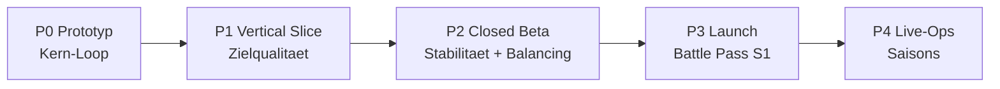

# Planet Forge – Roadmap: Vom Prototyp bis Live-Ops

Dieser Phasenplan führt Planet Forge vom heutigen Code-Skelett (P0) bis zum laufenden Live-Betrieb (P4). Er ist auf ein Team von **1–2 Personen in Teilzeit** ausgelegt. Jede Phase hat harte Ausstiegskriterien ("done wenn …") – erst wenn diese erfüllt sind, beginnt die nächste Phase. Scope-Disziplin ist die wichtigste Regel dieses Plans.

Verwandte Dokumente: [Spieldesign](GAME_DESIGN.md) · [Events](EVENTS.md) · [Multiplayer](MULTIPLAYER.md) · [Monetarisierung](MONETARISIERUNG.md) · [Architektur](ARCHITEKTUR.md)

---

## 1. Phasenübersicht

| Phase | Ziel | Kerninhalte | Grobe Dauer (1–2 Personen, Teilzeit) |
|---|---|---|---|
| **P0 Prototyp** | Spielbarer Kern-Loop, Spaßtest bestehen | Vorhandenes Skelett: Biome bauen/upgraden (12 Slots), Energie (manuell + passiv), Loot-Rolls mit Ultra-Rares (1:10.000 / 1:100.000 / 1:1.000.000), globale Events, Besuche/Likes, Handel | **JETZT** – 2–4 Wochen Feinschliff |
| **P1 Vertical Slice** | Ein Ausschnitt in Zielqualität | Echte Biom-Modelle statt Platzhalter, 1–2 Minispiele als Energiequellen, Onboarding/Tutorial, Sound | 6–10 Wochen |
| **P2 Closed Beta** | Stabil, ausbalanciert, erste Einnahmen | ProfileStore/Session-Locking, Telemetrie + Balancing, Wettbewerbe, erste Kosmetik + Shop | 8–12 Wochen |
| **P3 Launch** | Öffentlicher Release mit Monetarisierung | Battle Pass Saison 1, Marketing-/Shorts-Plan, Übersetzung EN | 6–8 Wochen |
| **P4 Live-Ops** | Dauerbetrieb mit wachsendem Content | Saisonale Events, Clans/Galaxien, PvE-Bosse, Cross-Server-Besuche | fortlaufend (Saisons à 8–10 Wochen) |

---

## 2. P0 – Prototyp (JETZT)

### Einstieg / Ausstieg

- **Einstieg:** Erfüllt. Das Skelett steht: alle Services (`DataService`, `PlanetService`, `EnergyService`, `LootService`, `GlobalEventService`, `VisitService`, `TradeService`), Configs mit Canon-Balancing, Client-Controller.
- **Done wenn:**
  - Ein neuer Spieler kann ohne Erklärung durch Dritte: Energie sammeln → Biom bauen → upgraden → Fund-Wurf (25 Energie) → fremden Planeten besuchen → handeln.
  - Alle 5 globalen Events (Meteoritenschauer, Goldener Regen, Seltene Kreaturen, Alien-Invasion, Schwarzes Loch) laufen fehlerfrei durch inkl. Cross-Server-Broadcast.
  - Spaßtest mit 5–10 Testern bestanden (siehe KPIs).
  - Keine bekannten Wege, Energie oder Items zu duplizieren.

### Features

| Priorität | Feature | Status |
|---|---|---|
| Must | Kern-Loop: 12 Biom-Slots, Bau/Upgrade (maxLevel 5, Faktor 1,75), passives Einkommen alle 60 s | vorhanden |
| Must | Manuelles Sammeln (5 Energie, 6 s Cooldown), Loot-Roll für 25 Energie | vorhanden |
| Must | Ultra-Rare-Pipeline mit Server-Announcement bei Legendary+ | vorhanden |
| Must | Event-Scheduler (60-s-Takt, 25 % Chance, 15 min Mindestabstand) | vorhanden |
| Should | Besuche/Likes, Handel mit 3-s-Lock | vorhanden |
| Should | Platzhalter-UI aufräumen: klare Buttons, lesbare Energie-Anzeige | offen |
| Could | Einfache Partikeleffekte bei Biom-Bau und Ultra-Rare-Fund | offen |

**Bewusst NICHT in P0:** Minispiele, Clans, Kosmetik, Battle Pass, Wettbewerbe. P0 klein halten ist die Burnout-Versicherung (siehe Risiken).

### Technische Schulden (akzeptiert, dokumentiert)

In P0 werden Schulden **nicht** abgebaut, nur dokumentiert (Details in [ARCHITEKTUR.md](ARCHITEKTUR.md)):

- `DataService`: Last-Writer-Wins **ohne** Session-Locking → Abbau in P2.
- `GlobalEventService`: jeder Server würfelt selbst, kein Leader → Abbau in P2/P4.
- Remotes: nur Basis-Validierung, keine systematischen Rate-Limits → Abbau in P2.

### KPIs P0

| KPI | Ziel | Begründung |
|---|---|---|
| Spaßtest | 5–10 Tester, mind. 7 von 10 wollen "noch eine Runde" | Kleinste aussagekräftige Stichprobe; wenn der nackte Loop ohne Grafik nicht trägt, rettet ihn auch P1 nicht |
| Session-Länge | > 15 min Median | Roblox-Sitzungen unter 10 min gelten als schwach; 15 min zeigt, dass der Loop (sammeln → bauen → würfeln) selbsttragend ist |
| Kritische Bugs | 0 bekannte Dupes/Datenverluste | Handel + Persistenz müssen vor jedem externen Test wasserdicht sein |

---

## 3. P1 – Vertical Slice

### Einstieg / Ausstieg

- **Einstieg:** P0-Ausstiegskriterien erfüllt.
- **Done wenn:**
  - Alle 10 Biome haben echte 3D-Modelle mit Level-Visualisierung (Level 1 → 5 sichtbar unterschiedlich); der "Glowup" eines Planeten ist auf einem Screenshot erkennbar.
  - 1–2 Minispiele liefern Energie und machen isoliert Spaß (Tester-Urteil).
  - Ein neuer Spieler durchläuft das Tutorial ohne Abbruch bis zum ersten Biom-Bau (> 80 % Abschlussquote im Test).
  - Sound: Musik-Loop, UI-Sounds, Event-Fanfaren, Ultra-Rare-Jingle.

### Features

| Priorität | Feature | Systeme/Dateien |
|---|---|---|
| Must | Biom-Modelle + Level-Stufen | `PlanetService`, Assets, `PlanetBuilderController` |
| Must | Minispiel 1: "Meteoriten fangen" (Timing/Geschick, 10–20 Energie pro Runde) | neuer `MinigameService` + Client-Controller |
| Must | Onboarding: geführte erste 5 Minuten (sammeln → Wiese bauen für 25 → erster Loot-Roll) | `UIController`, neuer `TutorialController` |
| Should | Minispiel 2: "Energie-Parcours" auf dem eigenen Planeten | `MinigameService` |
| Should | Sound-Pass komplett | Client |
| Could | Tag/Nacht-Zyklus auf dem Planeten | Client, rein kosmetisch |

### Technische Schulden

- Client-Rendering vom Platzhalter-Code auf ein Asset-basiertes Biom-System umstellen (ein Modell pro Biom × Level, referenziert aus `BiomeConfig`).
- UI von Debug-Qualität auf produktionsnahe Struktur heben (ein konsistentes UI-Framework, kein Ad-hoc-Instancing).

### KPIs P1

| KPI | Ziel | Begründung |
|---|---|---|
| Tutorial-Abschluss | > 80 % | Auf Roblox entscheidet die erste Minute; unter 80 % ist das Onboarding das Problem, nicht das Spiel |
| Session-Länge | > 20 min Median | Minispiele + Visuals müssen den P0-Wert messbar heben, sonst tragen sie nicht |
| "Würdest du einen Freund einladen?" | > 50 % ja | Proxy für organische Verbreitung vor jeder Marketing-Ausgabe |

---

## 4. P2 – Closed Beta

### Einstieg / Ausstieg

- **Einstieg:** P1 fertig; Testgruppe von 50–200 Spielern rekrutiert (z. B. Discord).
- **Done wenn:**
  - Session-Locking live: kein Datenverlust-Report über 4 Wochen Beta.
  - Telemetrie liefert belastbare Funnels (Energie-Quellen/-Senken, Progression pro Biom-Stufe).
  - Erster Wettbewerb ("Schönster Planet") komplett durchgelaufen: Einreichung → Voting → Siegerehrung.
  - Shop mit 5–10 Kosmetik-Artikeln live, erste echte Käufe verbucht.
  - Retention-Ziele erreicht (siehe KPIs).

### Features

| Priorität | Feature | Systeme/Dateien |
|---|---|---|
| Must | ProfileStore-Integration mit Session-Locking | `DataService` (Kern-Umbau) |
| Must | Telemetrie: Events für Energie-Zufluss/-Abfluss, Loot-Rolls, Käufe (AnalyticsService + eigener Funnel) | neuer `TelemetryService` |
| Must | Rate-Limits auf allen Remotes (Token-Bucket pro Spieler) | `Remotes`, alle Services |
| Must | Balancing-Pass anhand Telemetrie (Biom-Kurve 25 → 100.000 bleibt Canon; justiert werden Minispiel-Erträge und Loot-Pool-Inhalte, nicht die Tier-Gewichte 60/25/10/4/1) | `CollectibleConfig`, Minispiele |
| Should | Wettbewerbe: Einreichung, Voting, Saisonpokal (siehe [MULTIPLAYER.md](MULTIPLAYER.md)) | neuer `CompetitionService` |
| Should | Shop + erste Kosmetik (Planeten-Skins, Wettereffekte; siehe [MONETARISIERUNG.md](MONETARISIERUNG.md)) | neuer `ShopService`, `UIController` |
| Could | Trade-Historie im UI einsehbar | `TradeService`, `UIController` |

### Technische Schulden (Abbau-Schwerpunkt dieser Phase)

| Schuld | Maßnahme | Referenz |
|---|---|---|
| Last-Writer-Wins ohne Session-Locking | ProfileStore (oder gleichwertig) mit Session-Lock + geordneter Übergabe bei Server-Wechsel | [ARCHITEKTUR.md](ARCHITEKTUR.md), Kommentar in `DataService.luau` |
| Fehlende Rate-Limits | Zentrale Remote-Middleware, Limits pro Endpunkt (z. B. CollectEnergy hart an 6-s-Cooldown gekoppelt) | [ARCHITEKTUR.md](ARCHITEKTUR.md) |
| Handel ohne Audit-Trail | Trade-Logging in DataStore (beide Seiten, Zeitstempel, Item-Snapshots) + manuelles Rollback-Werkzeug | `TradeService` |
| Event-Start pro Server gewürfelt | Vorstufe: MemoryStore-basierte Leader-Wahl, damit Event-Frequenz nicht mit der Serverzahl skaliert | [EVENTS.md](EVENTS.md) Abschnitt 4.2 |

### KPIs P2

| KPI | Ziel | Begründung |
|---|---|---|
| D1-Retention | > 25 % | Roblox-Median für neue Spiele liegt grob bei 15–20 %; 25 % zeigt einen überdurchschnittlichen Hook und ist Voraussetzung dafür, dass Roblox' Discovery das Spiel überhaupt trägt |
| D7-Retention | > 8 % | Für ein Progressions-/Sammelspiel ist D7 der Beweis, dass der Langzeit-Loop (Biom-Kurve bis Kosmische Ebene, Ultra-Rare-Jagd) funktioniert; 8 % ist für Simulator-artige Spiele ein solider Wert |
| Crash-/Datenverlustfrei | 0 bestätigte Datenverluste, Fehlerrate < 0,5 % der Sessions | Ein einziger viraler "Spielstand weg"-Post kann eine Beta-Community töten |
| Median-Sessions/Tag | ≥ 2 bei aktiven Spielern | Passives Einkommen + Events sollen Mehrfach-Logins erzeugen |

---

## 5. P3 – Launch

### Einstieg / Ausstieg

- **Einstieg:** P2-KPIs erreicht, keine offenen Must-Bugs.
- **Done wenn:**
  - Battle Pass Saison 1 (kostenloser + Premium-Track, rein kosmetisch) live und bis Saisonende betreibbar.
  - Spiel vollständig auf EN verfügbar (UI, Item-Namen, Tutorial); DE bleibt Primärsprache.
  - Marketing-Plan ausgeführt: 10+ vorbereitete Shorts/TikToks, 3 Thumbnail-Varianten im A/B-Test, Presse-/Creator-Kit.
  - Launch-KPIs über 4 Wochen stabil (siehe unten).

### Features

| Priorität | Feature | Systeme/Dateien |
|---|---|---|
| Must | Battle Pass Saison 1 (Details: [MONETARISIERUNG.md](MONETARISIERUNG.md)) | neuer `BattlePassService`, `UIController` |
| Must | Lokalisierung EN (Roblox LocalizationService, alle Strings extern) | alle Client-Module, Configs (Anzeigenamen) |
| Must | Shorts-Plan: Capture-Modus für Ultra-Rare-Momente (siehe Abschnitt 8) | Client |
| Should | Gruppen-/Follower-Boni (rein kosmetisch, z. B. Titel) | `DataService` |
| Could | Planeten-Schnappschuss-Funktion (Foto-Modus mit Wasserzeichen) | Client |

### Technische Schulden

- Lasttest: Zielserver mit 30–50 CCU, Messung von MessagingService-Quoten und DataStore-Budget (Referenz [ARCHITEKTUR.md](ARCHITEKTUR.md)).
- Alarmierung: automatische Benachrichtigung bei Fehler-Spikes (Webhook an Discord).

### KPIs P3

| KPI | Ziel | Begründung |
|---|---|---|
| CCU | Woche 1: 100+ gleichzeitig; Monat 1: stabil 250+ | Unter ~100 CCU greift Roblox' Empfehlungs-Algorithmus kaum; 250+ stabil ist die Schwelle, ab der Discovery selbstverstärkend wird |
| Conversion (zahlende Spieler) | 2–4 % | Typischer Korridor für Nur-Kosmetik-Spiele auf Roblox; höhere Werte wären bei Kein-Pay-to-Win unrealistisch, niedrigere deuten auf schwaches Kosmetik-Angebot |
| ARPPU | 300–800 Robux/Monat | Korridor aus Battle Pass (Premium-Track) + 1–2 Shop-Käufen; deutlich höhere Ziele würden Pay-to-Win-Druck erzeugen, den das Design ausschließt |
| D1 / D7 | halten: > 25 % / > 8 % | Launch-Traffic ist kälter als Beta-Traffic; die Werte zu halten ist bereits ein Erfolg |

---

## 6. P4 – Live-Ops (fortlaufend)

### Einstieg / Ausstieg

- **Einstieg:** Launch-KPIs 4 Wochen stabil.
- **Done wenn:** nie – Live-Ops ist ein Betriebsmodus. Erfolgskriterium pro Saison: Retention hält, Saisoninhalt wird von > 30 % der aktiven Spieler abgeschlossen.

### Features (Reihenfolge nach Impact)

| Priorität | Feature | Systeme/Dateien |
|---|---|---|
| Must | Saisonale Events (Themen-Varianten der 5 Basis-Events + saisonale Collectibles) | `EventConfig`, `CollectibleConfig`, `GlobalEventService` |
| Must | Clans/Galaxien: gemeinsame Galaxie-Ansicht, Clan-Fortschritt (siehe [MULTIPLAYER.md](MULTIPLAYER.md)) | neuer `ClanService` |
| Should | PvE-Bosse für 2–8 Spieler (Event-gebunden, z. B. Alien-Mutterschiff) | neuer `BossService` |
| Should | Cross-Server-Besuche (Freunde per Teleport besuchen, ReservedServer/TeleportService) | `VisitService`-Ausbau |
| Could | Handels-Marktplatz mit Suchfunktion (asynchron statt 1:1) | `TradeService`-Ausbau |

### Technische Schulden

- Endausbau der Leader-Wahl: global synchronisierte Events über MemoryStore-Leader ([EVENTS.md](EVENTS.md) 4.2), damit "Schwarzes Loch" wirklich überall gleichzeitig läuft – Voraussetzung für den serverübergreifenden Countdown als Marketing-Moment.
- Datenmodell-Migrationen versionieren (Profil-Schema-Version, Migrationsfunktionen in `DataService`).

### KPIs P4

| KPI | Ziel | Begründung |
|---|---|---|
| Saison-Abschlussquote | > 30 % der aktiven Spieler | Zeigt, dass der Battle Pass richtig dimensioniert ist (nicht zu grindig, nicht trivial) |
| Rückkehrer pro Saisonstart | +20 % WAU in Woche 1 der Saison | Saisons müssen abgewanderte Spieler zurückholen, sonst lohnt der Aufwand nicht |
| Content-Kadenz | 1 Saison / 8–10 Wochen ohne Crunch | Nachhaltigkeit vor Tempo (siehe Risiko Burnout) |

---

## 7. Risiken und Gegenmaßnahmen

| Risiko | Auswirkung | Gegenmaßnahme |
|---|---|---|
| **Content-Tretmühle** – Spieler verbrauchen Inhalte schneller als 1–2 Entwickler produzieren | Retention bricht ein, sobald "alles gebaut" ist | Systemische statt handgebaute Inhalte: globale Events und Wettbewerbe erzeugen Wiederkehr ohne neue Assets; Ultra-Rare-Jagd (1:10.000 bis 1:1.000.000) ist per Design unerschöpflich; neue Items nur als saisonale Ergänzung, nie als einzige Retention-Quelle |
| **Handels-Exploits** – Dupes, Scams, Item-Verlust | Ökonomie und Vertrauen zerstört, Ultra-Rares entwertet | 3-s-Sicherheits-Lock + atomare Ausführung (bereits im Skelett); ab P2: vollständiges Trade-Logging (beide Seiten, Snapshots) und getestete Rollback-Fähigkeit; Alarm bei anomalen Mustern (z. B. Neuaccount erhält Cosmic-Item) |
| **Balancing-Inflation** – Energie hortet sich, späte Biome trivial | Progression verliert Bedeutung, Handel inflationiert | Energie-Senken von Anfang an einplanen: Loot-Rolls (25 Energie) als Dauersenke, Upgrade-Kurve mit Faktor 1,75, ab P2 zusätzliche Senken (Wettbewerbs-Einschreibung, kosmetische Verbrauchseffekte); Telemetrie überwacht Zufluss/Abfluss-Verhältnis pro Spielstunde |
| **Sichtbarkeit auf Roblox** – Spiel geht in der Masse unter | Kein organisches Wachstum trotz gutem Spiel | Shorts-taugliche Momente gezielt bauen (Abschnitt 8); ab P3 systematische Thumbnail-/Icon-A/B-Tests; Creator-Kit für kleine YouTuber; Events als wiederkehrender "Grund, JETZT online zu gehen" |
| **Solo-Entwickler-Burnout** – Scope wächst, Energie sinkt | Projekt stirbt vor dem Launch | Scope-Disziplin als Prozess: P0 bewusst klein, harte Ausstiegskriterien pro Phase, Could-Features werden ersatzlos gestrichen statt verschoben; Saison-Kadenz 8–10 Wochen statt monatlich; ein fester "kein Feature"-Tag pro Woche für Wartung |

---

## 8. Content-/Marketing-Hooks (für TikTok / YouTube Shorts gebaut)

Diese Systeme sind bewusst so gestaltet, dass sie filmbare 15–60-Sekunden-Momente erzeugen:

1. **Ultra-Rare-Jackpot-Momente.** Der Fund eines Leuchtenden Kristalls (1:10.000), Goldenen Drachen (1:100.000) oder Kosmischen Kerns (1:1.000.000) löst ein serverweites Announcement mit Effekt aus. Das ist der "Slot-Machine-Clip": Reaktion + Seltenheitszahl im Bild. Ab P3 ergänzt ein Capture-Hinweis ("Clip aufnehmen?") den Moment.
2. **Schwarzes-Loch-Timer.** Das seltenste Event (Gewicht 10, 600 s, Energie x3) mit sichtbarem Countdown erzeugt "Alle sofort online!"-Clips und Livestream-Momente – ab P4 dank Leader-Wahl echt serverübergreifend gleichzeitig.
3. **Planeten-Glowups.** Vorher/Nachher ist das stärkste Format des Genres: kahler Fels → Kosmische Ebene. Der Foto-Modus (P3 Could) und die sichtbaren Level-Stufen der Biom-Modelle (P1) sind genau dafür gebaut. Wettbewerbe (P2) liefern kuratierte Glowups frei Haus.
4. **Wettbewerbs-Siegerehrungen.** "Der schönste Planet des Servers" als wöchentliches, teilbares Ergebnisformat.
5. **Handels-Drama.** Seltene Items + sichtbarer Handels-Log erzeugen "Ich habe einen Goldenen Drachen für X getauscht"-Stories – organisch, ohne eigenes Zutun.

---

## 9. Nächste 10 konkrete Schritte (vom Skelett zu P1)

1. **Spaßtest-Build vorbereiten:** Debug-Ausgaben entfernen, Energie-HUD und Biom-Menü lesbar machen (`src/client/Controllers/UIController.luau`).
2. **Testleitfaden + 5–10 Tester organisieren:** feste Aufgabenliste (bauen, upgraden, Loot-Roll, Besuch, Handel), Beobachtungsprotokoll (kein Code, Doku im Projektordner).
3. **Erkenntnisse einarbeiten:** die 3 größten Verständnis-Blocker aus dem Test fixen, bevor irgendein P1-Feature startet (`UIController.luau`, ggf. `Remotes.luau` für fehlendes Feedback).
4. **Biom-Asset-Pipeline definieren:** Namenskonvention `Biome_<id>_L<level>` in ReplicatedStorage, Lade-Logik im Client (`src/client/Controllers/PlanetBuilderController.luau`, `src/shared/Config/BiomeConfig.luau` um `modelPrefix` ergänzen).
5. **Erste 3 Biome modellieren (Wiese, Wald, Wüste) mit je 5 Level-Stufen:** beweist die Pipeline, bevor alle 10 Biome gebaut werden (Assets + `PlanetBuilderController.luau`).
6. **`MinigameService.luau` anlegen:** Server-seitige Rundenverwaltung, Energie-Gutschrift über `EnergyService`, Remote-Definitionen in `src/shared/Remotes.luau` ergänzen (`src/server/Services/MinigameService.luau`).
7. **Minispiel 1 "Meteoriten fangen" bauen:** Client-Teil als neuer Controller (`src/client/Controllers/MinigameController.luau`), Ertrag 10–20 Energie pro Runde, serverseitig validiert (max. Ertrag pro Zeitfenster).
8. **`TutorialController.luau` anlegen:** Schritt-für-Schritt-Overlay für die ersten 5 Minuten (sammeln → Wiese für 25 bauen → erster Loot-Roll für 25), Fortschritt im Profil speichern (`src/server/Services/DataService.luau`: Feld `tutorialStep` im Profil, `src/shared/Types.luau` erweitern).
9. **Sound-Pass:** zentrale Sound-Tabelle (neues Modul `src/shared/Config/SoundConfig.luau`), Einbindung in `UIController.luau` und `EventNotifierController.luau` (Event-Fanfare, Ultra-Rare-Jingle).
10. **P1-Abnahme gegen Ausstiegskriterien:** Tutorial-Abschlussquote messen (einfacher Zähl-Print reicht in P1), Session-Länge erheben, Go/No-Go für P2 dokumentieren.

---

*Stand: Juli 2026. Änderungen an Canon-Zahlen (Biomkosten, Event-Werte, Ultra-Rare-Chancen) erfordern ein Update von [GAME_DESIGN.md](GAME_DESIGN.md), den Configs unter `src/shared/Config/` und diesem Dokument in einem Zug.*
